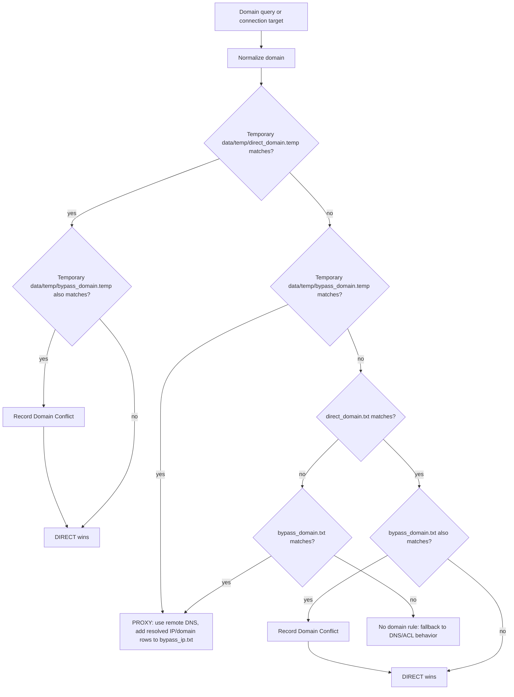
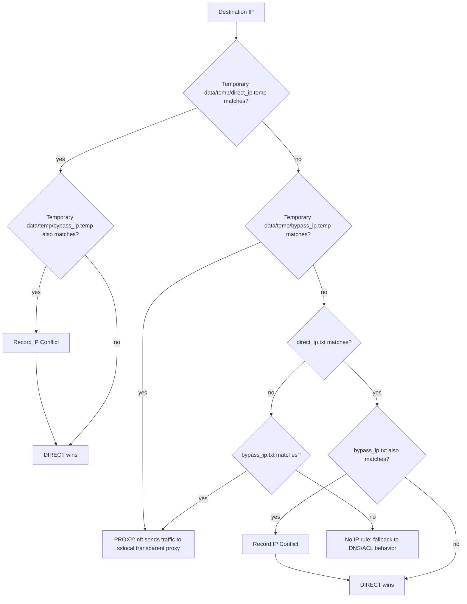
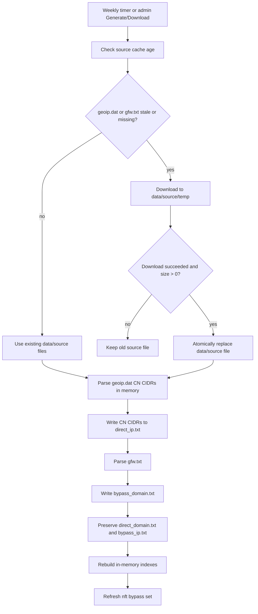
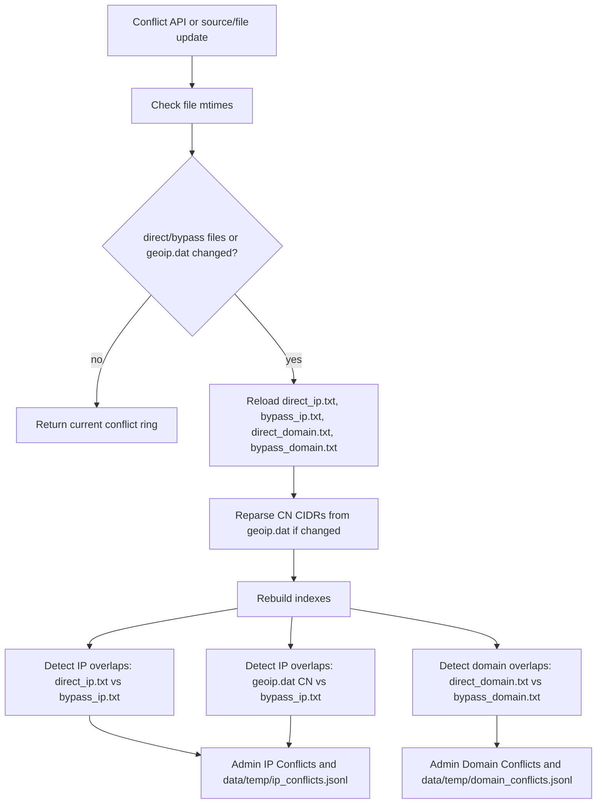
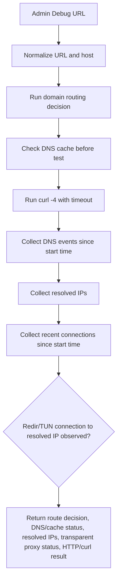
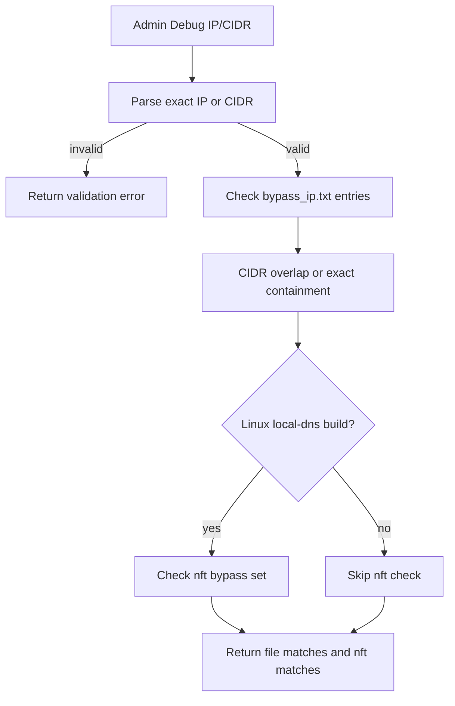

# Routing Logic Flow

This document describes the runtime route decision flow used by the redir and
admin routing state.

## Domain Decision

Multi-label domain rules match themselves and subdomains, so `pki.goog` also
matches `c.pki.goog`. Single-label rules such as `cn` are exact-only, so they do
not match every `.cn` domain. Use `*` for explicit wildcard matching, for
example `*.google.com`. If a domain matches both direct and bypass domain rules,
the admin page shows a Domain Conflict and the direct rule wins. Example:
`www.google.com` in `direct_domain.txt` wins over `*.google.com` in
`bypass_domain.txt`.

## IP Decision

IP rules handle exact IPs and CIDRs. `direct_ip.txt` has priority over
`bypass_ip.txt`, including CIDR overlaps. `bypass_ip.txt` may include an
optional second domain column, stores one row per IP/CIDR, and routing uses the
first IP/CIDR column.

## Source Update And Reindex

Only `geoip.dat` and `gfw.txt` are downloaded source files.

## Conflict Detection

IP conflict checks use CIDR overlap and read the first IP/CIDR column from
`bypass_ip.txt`. Domain conflict checks use exact, subdomain, and wildcard
overlap matching. Single-label rules do not act as top-level-domain wildcards.

## Debug URL

## Debug IP / CIDR

## Connection Recording

When the admin Connections page Record checkbox is enabled, the server truncates
`data/record.txt` and starts a new record session. Each subsequent connections
API response appends newly seen connection rows as JSON lines. Turning Record off
stops writing; it does not clear the current file.

Rows with decision `observed` are kernel-observed connections from conntrack or
`/proc/net/*` that were not matched to an in-memory sslocal flow decision.
