# 路由技术设计

本文档说明当前代码中路由系统的技术原理、主要模块职责、实现逻辑和端到端流程。这里的“路由”覆盖四类行为：

- 根据 IP/域名规则判断连接应直连还是代理。
- 根据域名规则选择 DNS 使用 local resolver 还是 remote resolver。
- 从 DNS 结果中学习 IP，并把运行时结果同步到规则文件和 Linux nft set。
- 通过管理后台生成规则、查看冲突、调试 URL/IP、记录连接和 DNS 活动。

## 模块地图


| 模块             | 主要代码                                                          | 职责                                                                       |
| -------------- | ------------------------------------------------------------- | ------------------------------------------------------------------------ |
| 配置解析           | `crates/shadowsocks-service/src/config.rs`                    | 定义 `RouteRulesConfig`、默认值、JSON 字段解析和旧字段迁移。                               |
| 路由状态核心         | `crates/shadowsocks-service/src/local/routing.rs`             | 维护规则、DNS 缓存、冲突、连接事件、DNS 事件、运行时 IP 学习和后台规则更新。                             |
| 本地服务装配         | `crates/shadowsocks-service/src/local/mod.rs`                 | 初始化 `RoutingState`，从第一个 DNS listener 派生 DNS 运行时状态，安装或清理 Linux DNS 防火墙拦截。 |
| DNS 服务         | `crates/shadowsocks-service/src/local/dns/server.rs`          | 在 DNS 查询路径中调用路由决策、DNS 缓存、IPv4-only 过滤和运行时 IP 学习。                         |
| Linux DNS 拦截   | `crates/shadowsocks-service/src/local/dns/intercept_linux.rs` | 安装 `nftables`/`iptables` DNS 重定向规则，维护 bypass nft set。                    |
| TUN UDP DNS 拦截 | `crates/shadowsocks-service/src/local/tun/udp.rs`             | 在 TUN UDP 路径捕获 53 端口 DNS，并转发到本地 DNS listener。                            |
| Windows TUN 路由 | `crates/shadowsocks-service/src/local/tun/mod.rs`             | 为 Windows TUN 安装 catch-all 路由和物理网卡直连例外。                                  |
| 管理后台           | `crates/shadowsocks-service/src/local/web_admin/mod.rs`       | 提供配置、规则生成、临时规则、DNS 缓存、冲突、Debug URL/IP、连接记录 API。                          |
| 路由调用方          | `local/context.rs`、redir/tun/socks/http/udp relay             | 在连接路径中调用 `check_target_bypassed` 或记录连接决策。                                |


## 核心概念

### Direct 和 Proxy

运行时路由决策使用 `RouteDecision`：

- `Direct`：连接直连，不经过 Shadowsocks；DNS 查询使用 local resolver。
- `Proxy`：连接走 Shadowsocks；DNS 查询使用 remote resolver。

`RouteDecision::Direct.is_bypassed()` 返回 `true`。这和 shadowsocks-rust 现有语义一致：`bypassed` 表示绕过代理直连。

连接活动使用另一组 `ConnectionDecision`：

- `direct`
- `proxy`
- `http_proxy`
- `socks5_proxy`
- `redir`
- `tun`
- `observed`

`RouteDecision` 是路由判断结果；`ConnectionDecision` 是某条连接实际被哪个入口或代理类型处理的记录结果。

### 运行时状态

`RoutingState` 是路由系统的主对象，内部包含四类状态：

- `inner: TokioRwLock<RoutingInner>`：规则、缓存、事件、冲突等主要可变状态。
- `progress: StdRwLock<RuleUpdateProgress>`：规则下载/生成进度。
- `dns_ipv4_only_flag: AtomicBool`：DNS 热路径读取的 IPv4-only 开关镜像，避免每次 DNS 应答处理都拿异步锁。
- `dns_runtime: TokioRwLock<DnsRuntimeState>`：从第一个 `protocol: "dns"` listener 派生出来的 domestic/foreign DNS 和 listen 地址。

`RoutingInner` 中的重要字段：

- `sources`：`geoip_sources`、`bypass_domain_sources`、DNS 缓存参数、DNS 拦截模式。
- `persistent_raw` / `temporary_raw`：原始规则行。
- `persistent` / `temporary`：编译后的 IP/域名索引。
- `geoip_cn`：从 `data/source/geoip.dat` 解析出的 CN CIDR。
- `*_modified`：规则文件和 `geoip.dat` 的 mtime，用于冲突 API 懒刷新。
- `ip_conflicts` / `domain_conflicts`：当前冲突结果。
- `connections` / `dns`：最近连接和最近 DNS 事件，最多 4096 条，默认保留 300 秒。
- `flow_decisions`：5 元组到权威连接决策的映射，TTL 1 小时，用于重标记 conntrack 或 `/proc/net/*` 中看到的长连接。
- `reverse_domains`：IP 到域名的反向映射，来自 DNS 结果。
- `dns_cache` / `dns_cache_order`：路由 DNS 缓存和 FIFO 容量控制队列。
- `bypass_ip_dirty` / `bypass_ip_persist_scheduled`：运行时学习到的 proxy IP 是否需要延迟写入 `bypass_ip.txt`。

## 配置

### 配置文件位置

部署目录固定为 `shadowsocks/{bin,conf,data,logs}`, 客户端配置文件： `conf/shadowsocks-client.json`：

- Linux/Unix 默认是 `/usr/local/shadowsocks/conf/shadowsocks-client.json`。
- Windows 默认是 `D:\software\shadowsocks\conf\shadowsocks-client.json`。

### 配置文件说明

- 下载来源缓存：
  - `data/source/geoip.dat`：由 `shadowsocks-client.json` 的 `geoip_sources` 字段下载，只用于管理页面 Route 中的 IP Conflicts 检测。
  - `data/source/gfw.txt`：由 `shadowsocks-client.json` 的 `bypass_domain_sources` 字段下载，用来生成 `data/bypass_domain.txt`。
- 上游内容默认来自 [https://github.com/Loyalsoldier/v2ray-rules-dat/releases/latest/download/geoip.dat](https://github.com/Loyalsoldier/v2ray-rules-dat/releases/latest/download/geoip.dat) 和 [https://raw.githubusercontent.com/Loyalsoldier/v2ray-rules-dat/release/gfw.txt。](https://raw.githubusercontent.com/Loyalsoldier/v2ray-rules-dat/release/gfw.txt。)
- 本地 `data/source/geoip.dat` 和 `data/source/gfw.txt` 由当前 `sslocal` 进程里的 `RoutingState` 下载、缓存和原子替换。

`RouteRulesConfig` 的主要字段：

- `geoip_sources`：geoip 冲突检测来源。默认包含 Loyalsoldier 的 `geoip.dat`。
- `bypass_domain_sources`：bypass 域名来源。默认包含 Loyalsoldier 的 `gfw.txt`。
- `dns_cache_capacity`：路由 DNS 缓存容量。默认 `100000`，解析配置时至少为 `1`。
- `dns_cache_ttl_seconds`：路由 DNS 缓存 TTL。默认 `604800` 秒，解析配置时至少为 `1`。
- `dns_cache_refresh_enabled`：是否刷新 proxy DNS 缓存。默认 `true`。
- `dns_cache_refresh_batch_size`：每批刷新 proxy DNS 缓存条数。默认 `500`，解析配置时至少为 `1`。
- `dns_intercept_mode`：`"off"`、`"firewall"`、`"tun"` 或 `"both"`。默认 `"off"`。
- `dns_ipv4_only`：是否过滤 AAAA 响应。默认 `true`。

## 规则生成模块

### 技术原理

规则生成把“来源文件”与“运行时规则文件”分离：

- `geoip.dat` 解析 CN CIDR，只参与 IP 冲突检测，不生成 `direct_ip.txt`。
- `bypass_domain_sources` 用于生成 bypass 域名候选，默认解析 `data/source/gfw.txt` 并生成 `data/bypass_domain.txt`。
- `direct_ip.txt` 不由下载来源、DNS 学习或 Temporary Lists 覆盖，始终保留用户手动维护内容，默认空。
- `direct_domain.txt` 不由下载来源或 Temporary Lists 覆盖，始终保留用户手动维护内容，默认空；如果当前文件不为空，Generate 不会清理它。
- `bypass_ip.txt` 由运行时 Proxy DNS 学习而来，Generate 时会读取并保留其中可解析的 learned IP/CIDR 行。
- Temporary Lists 只保存到 `data/temp/*.temp` 并恢复到 temporary 内存索引，不会并入四个持久化规则文件。

### 来源下载

HTTP(S) source 会缓存到 `data/source/<源文件名>`。每次触发 Download、Generate 或每周后台 update 时，都会真实执行下载流程，不会因为缓存未过期而跳过。下载时按顺序尝试：

- `uclient-fetch`
- `wget`
- `curl`

下载结果先写入 `data/source/temp`，成功且非空后原子替换缓存文件。如果下载失败或输出为空，不替换 `data/source` 下的旧文件；旧文件存在且非空时继续使用旧文件。如果没有可用旧文件，则本次任务失败。

本地路径 source 不走缓存，直接读取文件。

### geoip.dat / gfw.txt 更新职责和周期

默认来源由 `route_rules.geoip_sources` 和 `route_rules.bypass_domain_sources` 指定。每周后台任务会走完整 Generate 路径；管理后台 Download 只刷新 `data/source`，管理后台 Generate 会在刷新 `data/source` 后继续重建规则文件和冲突缓存。

### geoip.dat 解析

`parse_geoip_cn_nets` 直接解析 `geoip.dat` 的 protobuf-like length-delimited 字段：

- 读取顶层 entry。
- 读取国家代码字段，转小写后只保留 `cn`。
- 读取 CIDR 字段中的 IP bytes 和 prefix。
- 支持 IPv4 和 IPv6。
- 结果排序并去重。

如果来源不能按 `geoip.dat` 解析，则退回为普通文本 IP/CIDR 解析，仅作为 geoip 冲突检测候选。

### 完整生成流程

Generate 路径会在规则文件写入完成后更新内存索引，因此新 DNS 查询和新连接可以立即使用新的 direct/bypass 规则。管理后台手动 Generate 成功后还会安排服务重启；重启会重新装配 listener，并在 Linux firewall 模式下重新同步 nft bypass set。每周后台 Generate 只更新文件和内存索引，不主动重启服务。


注：
流程图中的“数据清洗”指写入四个持久化规则文件前，对 `direct_ip`、`direct_domain`、`bypass_ip`、`bypass_domain` 四组列表做统一整理：去掉空行；域名转小写、去掉末尾 `.`，并去掉 `domain:` / `full:` / `regexp:` / `keyword:` 前缀；排序并去重。

流程图中的“合并保留的 learned bypass_ip”指 Generate 开始时读取当前 `data/bypass_ip.txt`，保留第一列能解析为 IP/CIDR 的 learned 行，并把这些行合并进本次生成的 `RuleLists.bypass_ip`。随后 `normalize_bypass_ip_lines` 会按第一列 IP/CIDR 去重；同一个 IP 同时存在一列行和带域名行时，优先保留带域名行。这里的“合并”不做 CIDR 覆盖压缩，也不会把被 CIDR 覆盖的单 IP 删除。最终结果会重新写回 `data/bypass_ip.txt`，并重新编译成内存中的 `persistent.bypass_ip` / `persistent.bypass_ip_exact` 索引。
`bypass_ip` 额外按第一列 IP/CIDR 去重，并优先保留带域名行。

例如 Generate 前 `data/bypass_ip.txt` 是：

```text
1.1.1.1
1.1.1.1 cloudflare.com
2.2.2.0/24
2.2.2.8 dns.example
bad-line
example.com
```

合并保留后是：

```text
1.1.1.1 cloudflare.com
2.2.2.0/24
2.2.2.8 dns.example
```

其中 `1.1.1.1` 与 `1.1.1.1 cloudflare.com` 按同一个 IP 去重并保留带域名行；`2.2.2.0/24` 与 `2.2.2.8 dns.example` 都保留，因为当前不做 CIDR 覆盖合并；`bad-line` 和 `example.com` 的第一列不是 IP/CIDR，会被丢弃。


### DNS 运行时来源

- `local_dns_address` / `local_dns_port` -> domestic DNS。
- `remote_dns_address` / `remote_dns_port` -> foreign DNS。
- `local_address` / `local_port` -> 本地 DNS listener。

## 启动生命周期

`RoutingState::load` 是路由状态的启动入口。

完整流程：

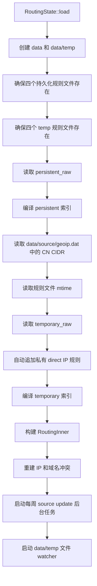


启动后，`LocalServerBuilder` 继续完成本地 listener 装配：

- 如果当前配置不是 `"firewall"` 或 `"both"`，Linux 启动时会尽力删除遗留的 `inet ssrust_dns` 表。
- 当启动 `protocol: "dns"` listener 且 `dns_intercept_mode` 是 `"firewall"` 或 `"both"` 时，会安装 Linux DNS 防火墙拦截。
- 防火墙安装成功后，会把当前 persistent + temporary bypass IP 规则同步到 nft bypass set，并过滤掉命中 persistent + temporary direct IP 的元素。
- 进程重启会重新读取 `data/temp/*.temp`，重建 Temporary Lists 的内存 index；后续域名决策、IP 决策和 nft 同步都继续遵守 temporary 优先级。

## 规则文件模型

### 持久化规则

- 持久化规则：
  - `data/direct_ip.txt`：由用户手动填入，默认空；Generate 时读取并原样保留。
  - `data/direct_domain.txt`：由用户手动填入，默认空；Generate 时读取并原样保留，当前文件不为空时不会被清理。
  - `data/bypass_ip.txt`：Generate 时保留其中可解析的 learned IP/CIDR 行。
  - `data/bypass_domain.txt`：Generate 时由 `bypass_domain_sources` 的解析结果生成，默认来源是 `data/source/gfw.txt`。
- 临时规则和冲突结果：`data/temp/`。
- 连接记录：`data/record.txt`。

这些文件用于稳定配置和生成结果。Temporary Lists 不会写入 `direct_ip.txt`、`direct_domain.txt`、`bypass_ip.txt` 或 `bypass_domain.txt`。`direct_ip.txt` 和 `direct_domain.txt` 是本地保留规则；`bypass_domain.txt` 通常由 source 生成；`bypass_ip.txt` 主要保存运行时从 DNS 学到的 proxy IP。

DNS 查询域名命中 `bypass_domain.txt` 或 Temporary Lists Bypass Domain 时使用 `remote_dns_address` 解析；未命中时使用 `local_dns_address`。如果同一域名同时命中 `direct_domain.txt` 或 Temporary Lists Direct Domain，则 direct 优先，使用 `local_dns_address`。

### 临时规则

临时规则位于 `data/temp`：

- `data/temp/direct_ip.temp`
- `data/temp/direct_domain.temp`
- `data/temp/bypass_ip.temp`
- `data/temp/bypass_domain.temp`

这些文件只用于持久化 Temporary Lists 内存状态，不参与生成四个持久化规则文件。临时规则优先级高于持久化规则。读取临时规则时，如果 `data/temp/*.temp` 为空但旧版 `data/*.temp` 有内容，会迁移旧内容。

Temporary Lists 的四类规则分别对应内存中的 temporary direct/bypass 域名和 IP 规则；它们可以临时覆盖 source 生成结果或用户持久化规则，但只落盘到 `data/temp/*.temp`。

代码还会自动把以下地址加入临时 direct IP 规则，用于保护私有、本地、链路本地和组播地址：

- `0.0.0.0/8`
- `127.0.0.0/8`
- `10.0.0.0/8`
- `100.64.0.0/10`
- `169.254.0.0/16`
- `172.16.0.0/12`
- `192.168.0.0/16`
- `198.18.0.0/15`
- `::/128`
- `::1/128`
- `fc00::/7`
- `fe80::/10`
- `ff00::/8`

### 规则读取和规范化

规则文件按行读取：

- `#` 后面的内容被视为注释。
- 空行会被忽略。
- 写入文件时使用临时文件 + rename 的原子写入方式。

IP 规则：

- 每行第一列是 IP 或 CIDR。
- 精确 IP 会转换为单 IP 网段。
- `bypass_ip.txt` 支持第二列域名，例如：

```text
142.250.72.14 www.google.com
```

`bypass_ip.txt` 规范化时按第一列 IP/CIDR 去重。如果同一个 IP 同时存在一列行和带域名行，优先保留带域名行。

域名规则：

- 会去掉首尾空白。
- 会去掉末尾 `.`。
- 会去掉 `domain:`、`full:`、`regexp:`、`keyword:` 前缀。
- 会转换为 ASCII 小写。

## 路由决策引擎

### 技术原理

路由决策是两层优先级：

1. 临时规则优先于持久化规则。
2. 同一层级中 direct 优先于 bypass/proxy。

返回值为 `Option<RouteDecision>`：

- `Some(Direct)`：明确直连。
- `Some(Proxy)`：明确代理。
- `None`：没有命中 routing rule，调用方继续走 ACL 或默认逻辑。

### 域名匹配

域名决策入口是 `route_domain_inner`。

匹配规则：

- `*` 通配符规则使用简单 wildcard 匹配。
- `*.baidu.com` 等同于 `baidu.com`，会同时匹配 `baidu.com` 和 `a.baidu.com`。
- 单标签规则只精确匹配，例如 `cn` 只匹配 `cn`。
- 多标签规则匹配自身和子域名，例如 `pki.goog` 匹配 `pki.goog` 和 `c.pki.goog`。
- direct 与 bypass 同时匹配时 direct 胜出。

完整流程：

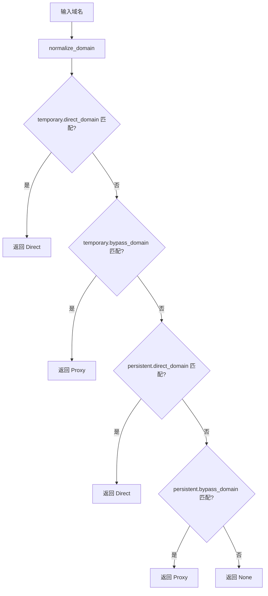


### IP 匹配

IP 决策入口是 `route_ip_inner`。

匹配规则：

- 精确 IP 使用 HashSet 快速匹配。
- CIDR 使用 `IpNet::contains` 判断。
- direct 与 bypass 同时匹配时 direct 胜出。
- `bypass_ip.txt` 的第二列域名不参与 IP 匹配。

完整流程：

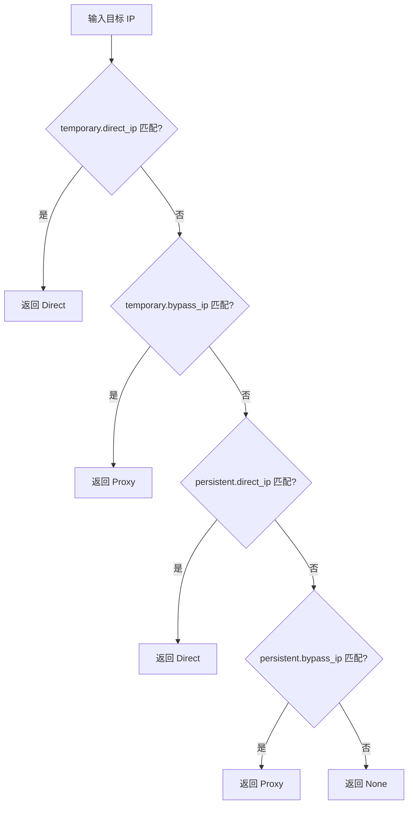


### 连接路径如何使用路由

`ServiceContext::check_target_bypassed` 是连接路径的统一入口之一：

1. 如果启用 web-admin/routing state，先调用 `routing_state.route_address`。
2. 命中 `Direct` 时返回 bypassed，即连接直连。
3. 命中 `Proxy` 时返回 not bypassed，即连接走代理。
4. 没命中规则时，继续使用 reverse DNS cache 和 ACL 判断。

redir、tun、socks、http、udp association 等模块会在连接建立或转发时记录 `ConnectionDecision`，供管理后台展示和 Debug URL 使用。

## DNS 服务集成

### 技术原理

DNS 服务承担两件事：

- 根据域名规则选择 local resolver 或 remote resolver。
- 把 DNS 结果反向反馈给路由系统，形成运行时 IP 规则和 nft bypass set。

DNS 路由只处理：

- `DNSClass::IN`
- 非 `PTR` 查询

### DNS 查询完整流程

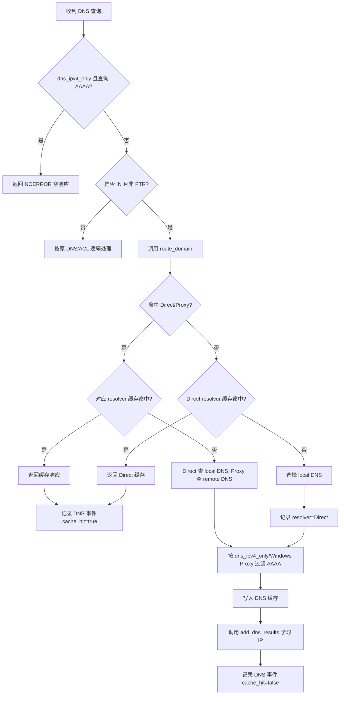


### IPv4-only 逻辑

`dns_ipv4_only = true` 时：

- AAAA 查询直接返回 NOERROR 空答案。
- 非 AAAA 查询返回结果中如果夹带 AAAA，也会过滤掉。

即使关闭全局 IPv4-only，Windows 上的 Proxy DNS 响应仍会过滤 AAAA。原因是当前 Windows TUN catch-all 只安装 IPv4 路由，保留 proxy AAAA 会导致浏览器先尝试无法连通的 IPv6。

### DNS 缓存

DNS 缓存 key 包含：

- 规范化域名。
- 查询类型。
- resolver：`Direct` 或 `Proxy`。

缓存行为：

- 插入时设置 `expires_at = now + dns_cache_ttl_seconds`。
- 查询前调用 `prune_dns_cache` 清理过期项。
- 超过 `dns_cache_capacity` 时按 FIFO 顺序移除旧 key。
- 管理后台支持按域名查询、按 IP 查询、按域名清理和全部清理。

Proxy 缓存刷新：

- DNS server 启动 remote DNS cache refresh 后台任务。
- 每 24 小时检查一次候选。
- 只刷新 resolver 为 `Proxy` 且 `refreshed_at` 超过 24 小时的缓存。
- 每批最多 `dns_cache_refresh_batch_size` 条。
- 刷新成功后替换 DNS message 和结果 IP，更新 `refreshed_at`，但保留原 `expires_at`。
- 刷新得到新 IP 时继续调用 `add_dns_results(RouteDecision::Proxy, ...)`。

## 运行时 IP 学习

### 技术原理

DNS 是域名规则和 IP 规则之间的桥。域名命中 proxy 后，后续透明代理真正看到的是目标 IP；因此系统需要把 proxy 域名解析出的 IP 学进
`bypass_ip.txt` 和 Linux nft bypass set。

Direct DNS 结果不会写入 `direct_ip.txt`，也不会加入 persistent direct 内存索引；它只会从 Linux bypass set 中移除对应 IP，避免 direct 域名的解析结果被旧 bypass set 重定向。

### add_dns_results 流程

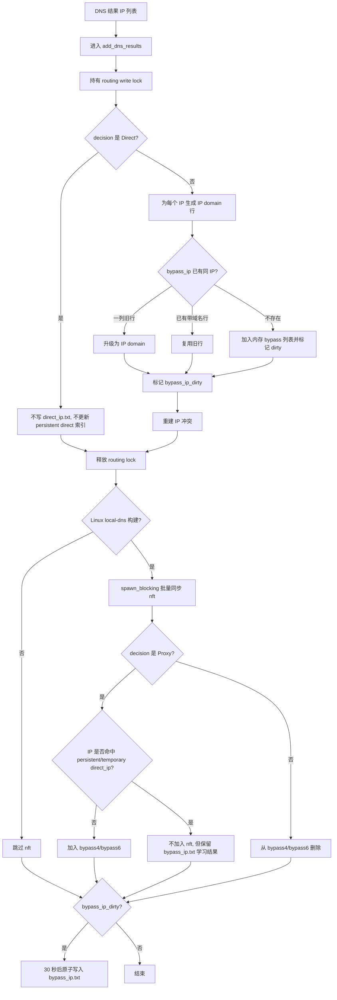


重要实现细节：

- Direct 分支不写入 `direct_ip.txt`，不更新 persistent direct 索引，只驱动 nft bypass 删除。
- Proxy 分支先更新内存并标记 dirty，随后延迟 30 秒批量写入 `bypass_ip.txt`。
- Proxy 分支解析出的 IP 即使命中 `direct_ip.txt` 或 Temporary Lists Direct IP，也会写入 `bypass_ip.txt`；但这类 IP 不会加入 nft bypass set。
- `bypass_ip.txt` 持久化使用原子写入，并会排序、去重、优先保留带域名行。
- Linux nft 同步放到 `spawn_blocking`，避免阻塞 Tokio worker。
- `nft -f -` 批量写入，按 IPv4/IPv6 和每 512 个元素分块。
- duplicate nft element 错误会被吞掉，因为规则文件和内存索引才是源数据。

### Generate 对 learned IP 的影响

`direct_ip.txt` 会在 Generate 时读取并保留；`data/temp/direct_ip.temp` 只用于恢复 Temporary Lists 的 Direct IP 内存规则。geoip.dat 不写入 `direct_ip.txt`，只用于 IP Conflicts。

`bypass_ip.txt` 中第一列可解析的 learned IP/CIDR 会在 Generate 开始时读取并保留，因此 proxy 学习结果会跨 Generate 保留。

## Linux DNS 防火墙拦截

### nftables 技术原理

Linux/OpenWrt 防火墙拦截使用 `inet ssrust_dns` 表。当前表中会创建四个 interval set：

- `direct4`
- `direct6`
- `bypass4`
- `bypass6`

当前 TCP 透明重定向规则实际使用的是 `bypass4` / `bypass6`。direct 优先级主要通过过滤或删除 bypass set 中与 direct 重叠的元素实现。`direct4` / `direct6` 作为辅助 set 创建，但当前重定向规则不依赖它们。

### nftables 安装流程

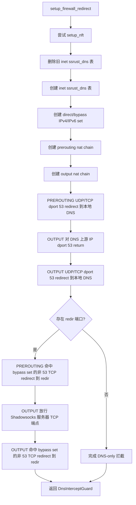


`DnsInterceptGuard` 在 drop 时会删除 `inet ssrust_dns` 表。非正常退出无法触发 drop，所以启动时如果当前配置不启用 firewall 模式，会主动清理遗留表。

### iptables 回退

如果 `setup_nft` 失败，会回退到 `setup_iptables`：

- `PREROUTING` UDP/TCP 53 redirect 到本地 DNS。
- `OUTPUT` UDP/TCP 53 redirect 到本地 DNS。

Linux redir/firewall 模式会拦截 UDP/TCP 53 DNS 请求。TUN 模式会在 TUN UDP/TCP 路径拦截目标端口 53 的 DNS 请求，并转发到同一个本地 DNS listener。

- `OUTPUT` 中先对 DNS 上游 IP 的 UDP/TCP 53 return。
- `OUTPUT` UDP/TCP 53 redirect 到本地 DNS。

iptables 回退不维护 bypass IP set，因此不能提供 nft bypass set 驱动的非 53 TCP 重定向能力。

### persistent/temporary 规则同步到 nft

防火墙安装成功后会调用 `sync_persistent_ip_rules_to_firewall`：

- 从 persistent bypass IP 中移除与 persistent direct IP 重叠的网段。
- flush `direct4`、`direct6`、`bypass4`、`bypass6`。
- 将过滤后的 bypass 网段写入 `bypass4` / `bypass6`。

临时规则保存后会重新计算临时 nft bypass：

- persistent direct + temporary direct 共同作为 direct 优先级来源。
- persistent bypass + temporary bypass 作为候选 bypass。
- 与 direct 重叠的 bypass 会被移除。
- 最终替换 nft bypass set。

## TUN 拦截和 Windows 路由

### TUN DNS 拦截

TUN DNS 拦截入口在 `UdpTun::handle_packet`：

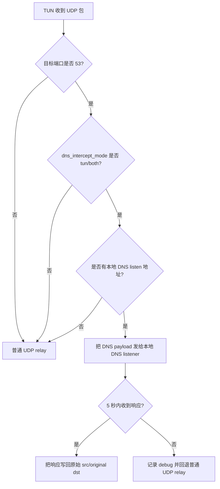


TUN TCP 路径在创建 TCP 透明连接时也检查目标端口 53；命中时直接连接本地 DNS listener 并做 TCP tunnel，不再按普通透明 TCP 连接转发。

如果 listen IP 是 unspecified，会改成 loopback：

- `0.0.0.0` -> `127.0.0.1`
- `::` -> `::1`

### Windows TUN 路由

Windows 使用 TUN 作为透明代理后端。TUN 启动时运行 PowerShell 安装路由：

- 在 TUN adapter 上安装 IPv4 catch-all：`0.0.0.0/1` 和 `128.0.0.0/1`。
- 在物理默认路由网卡上安装常见私有 IPv4 网段，避免内网流量进入 TUN。
- 如果存在 IPv6 默认路由，在物理网卡上安装 `fc00::/7`、`fe80::/10`。
- 为 Shadowsocks 服务器 IP 和 domestic DNS IP 安装 `/32` 物理网卡例外。
- 为物理网关安装 `/32` 例外。

foreign DNS 不加入物理网卡例外。remote DNS 查询通过 Shadowsocks 服务器封装发送，sslocal 不会直接连接 foreign DNS IP。具体实现上，remote resolver 走 DNS 模块的 `lookup_remote` 路径：DNS message 会交给 shadowsocks 客户端流发送到远端 DNS 地址；它不是一律把 UDP DNS 打包成 TCP，实际传输取决于 DNS listener 的 mode，`tcp_only` 使用 TCP，`udp_only` 使用 UDP，`tcp_and_udp` 会按配置/可用性选择或并发查询，插件不支持 UDP 时回退 TCP。

由于当前 Windows catch-all 只覆盖 IPv4，DNS proxy 响应会过滤 AAAA，避免客户端优先尝试不可达 IPv6。

## 冲突检测

### 技术原理

冲突检测用于发现 direct 和 bypass 规则之间的重叠，但不改变路由优先级。真正路由时 direct 仍然胜出。

冲突来源：

- `direct_ip.txt` vs `bypass_ip.txt`
- `data/source/geoip.dat` 中的 CN CIDR vs `bypass_ip.txt`
- `direct_domain.txt` vs `bypass_domain.txt`

临时规则不参与冲突持久化结果。

### 完整流程

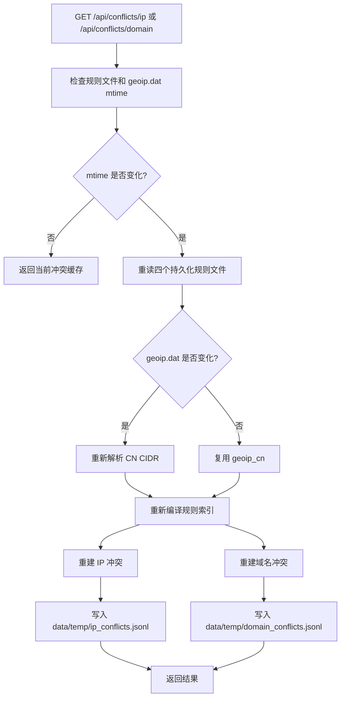


IP 冲突：

- 精确 IP 和 CIDR 都会转换为范围。
- IPv4 与 IPv6 分开比较。
- 输出格式为 `direct <-> bypass`，完全相同时只输出一个值。
- `bypass_ip.txt` 只读取第一列。

域名冲突：

- 精确规则会检查自身和多标签后缀候选。
- `*` 通配符会通过候选域名判断是否可能重叠。
- 单标签规则不会作为顶级域名通配符。

## 管理后台模块

### API 分组

主要 API：

- `GET /api/config/rules`：返回规则目录、source 配置和临时规则快照。
- `GET /api/temp-rules`：从 `data/temp` 重新读取临时规则并刷新内存临时索引。
- `PUT /api/temp-rules`：写入临时规则并刷新 nft bypass set。
- `POST /api/rules/download`：下载 source。
- `POST /api/rules/update`：下载并生成规则。
- `GET /api/rules/update-progress`：读取下载/生成进度。
- `GET /api/dns` / `PUT /api/dns`：读取或热更新 runtime domestic/foreign DNS。
- `GET /api/dns/cache/stats`：DNS 缓存统计。
- `GET /api/dns/cache/query`：按域名查 DNS 缓存。
- `GET /api/dns/cache/query-ip`：按 IP 查 DNS 缓存。
- `POST /api/dns/cache/clear`：清理 DNS 缓存。
- `GET /api/conflicts/ip` / `GET /api/conflicts/domain`：冲突检测。
- `POST /api/sys/debug-url`：调试 URL。
- `POST /api/sys/debug-ip`：调试 IP/CIDR。
- `GET /api/activity/connections`：最近连接。
- `GET /api/activity/dns`：最近 DNS。
- `POST /api/activity/record/start` / `stop`：开始或停止连接记录。

管理后台只允许 LAN 或 loopback 访问；如果配置了 token，会校验 `x-admin-token`、Bearer token 或 query token。

### Debug URL

`debug_url` 用于验证“域名规则 -> DNS -> 透明代理连接”链路。

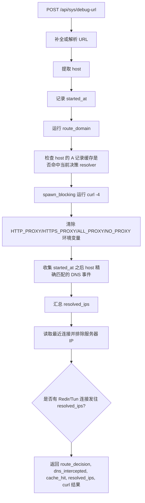


注意：

- `curl` 固定使用 `-4`，超时 6 秒。
- `dns_cache_hit` 只检查 host 的 A 记录，并且 resolver 必须等于当前 `route_domain` 决策。
- 如果没有域名规则，真实 DNS 查询可能会命中 fallback cache，但 Debug URL 的 `dns_cache_hit` 仍可能是 false。

### Debug IP / CIDR

`debug_ip_membership` 用于验证一个 IP/CIDR 是否在持久化 `bypass_ip.txt` 或 Linux nft bypass set 中。

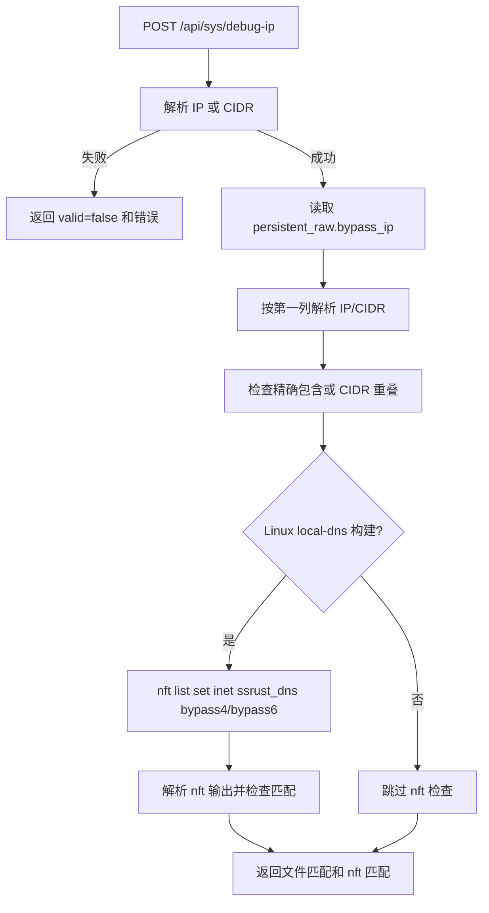


Debug IP 不检查临时规则，也不检查 direct 规则。

## 连接和 DNS 活动记录

### 连接事件

连接事件来源：

- socks4/socks5/http/udp association 根据实际 direct/proxy 决策记录。
- redir TCP 入口记录 `ConnectionDecision::Redir`。
- TUN TCP 入口记录 `ConnectionDecision::Tun`。
- Linux conntrack 和 `/proc/net/tcp*`、`/proc/net/udp*` 作为内核观察来源。

记录逻辑：

- 目标是私有地址的连接不记录。
- 内存事件最多 4096 条，保留 300 秒。
- 同时维护 5 元组 -> 决策的 `flow_decisions`，最多 4096 条，TTL 1 小时。
- 展示最近连接时，会用 `flow_decisions` 把内核观察到的长连接重新标记为原始决策。
- 仍无法匹配的内核连接标记为 `observed`。
- 管理后台读取连接时会排除配置文件里的 Shadowsocks 服务器 IP。

### 连接记录文件

启用 Record 时：

1. `POST /api/activity/record/start` 截断 `data/record.txt`。
2. 清空本轮已记录连接 key 集合。
3. 每次 `GET /api/activity/connections` 会把本次新出现的连接追加为 JSON Lines。
4. `POST /api/activity/record/stop` 停止写入，但不清空文件。

### DNS 事件

DNS 事件包含：

- timestamp
- domain
- query_type
- results
- resolver
- cache_hit

DNS 事件同样最多 4096 条，保留 300 秒。DNS 结果还会更新 `reverse_domains`，用于连接列表中把 IP 反查为域名。

## 端到端流程

### 首次访问 Proxy 域名

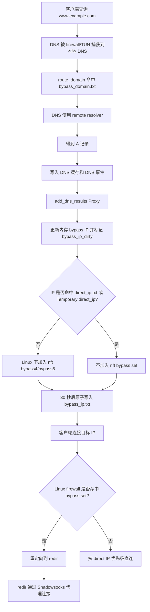


### 首次访问 Direct 域名


### 无显式域名规则的 DNS 查询

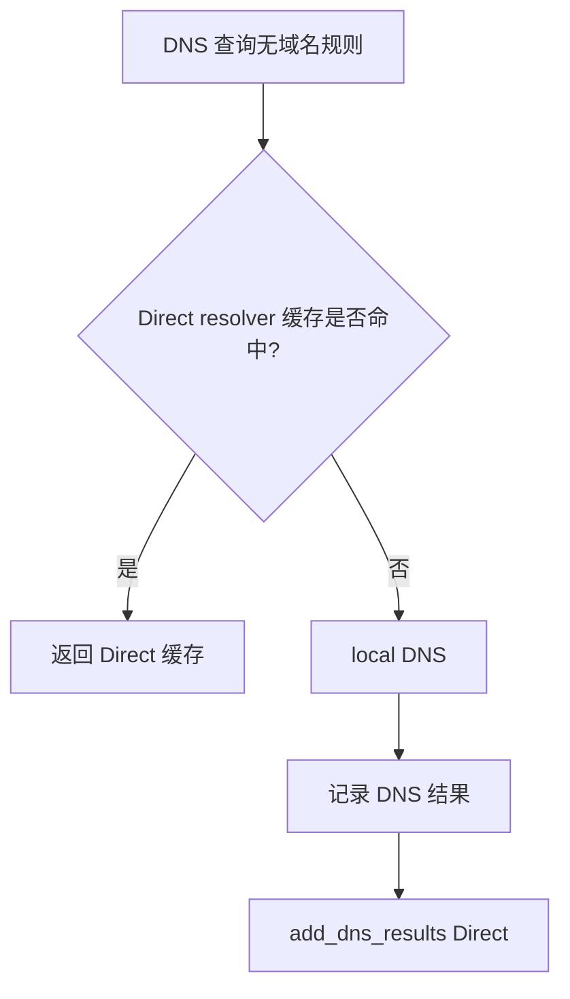


### 管理后台 Generate

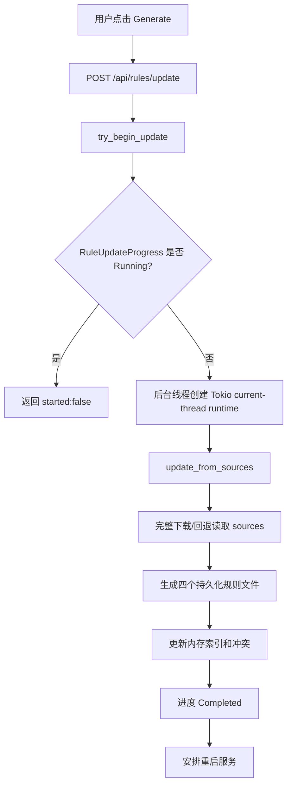


### 临时 bypass IP 生效

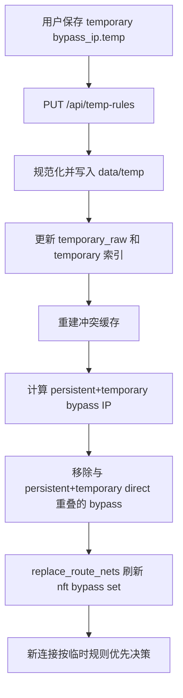


## 运维注意事项

- Linux firewall 模式需要 root 权限或等效 capability。
- `nftables` 是完整功能路径；`iptables` 只提供 DNS 53 端口重定向回退。
- 如果本地 DNS 上游 IP 没有被放行，DNS 请求会回环到本地 DNS listener。
- `dns_ipv4_only` 默认启用，会改变 AAAA 查询结果；只有主机有可用公网 IPv6 时才建议关闭。
- Temporary Lists 只持久化在 `data/temp/*.temp`，不会写入 `direct_ip.txt`、`direct_domain.txt`、`bypass_ip.txt` 或 `bypass_domain.txt`。
- Direct DNS 学习结果不写入 `direct_ip.txt`。
- `bypass_ip.txt` 中可解析 learned 行会被 Generate 保留。
- 临时规则优先生效，但不写入冲突 JSONL。
- Debug IP 只验证持久化 `bypass_ip.txt` 和 nft bypass set，不代表完整路由决策。
- Debug URL 使用 `curl -4`，因此主要验证 IPv4 透明代理链路。
