# 路由技术设计

本文档说明当前代码中路由系统的技术原理、主要模块职责、实现逻辑和端到端流程。这里的“路由”覆盖四类行为：

- 根据 IP/域名规则判断连接应走 Direct 还是 Proxy。
- 根据域名规则选择 DNS 使用 Direct resolver 还是 Proxy resolver。
- 从 DNS 结果中学习 IP，并把运行时结果同步到规则文件和 Linux nft set。
- 通过管理后台生成规则、查看冲突、调试 URL/IP、记录连接和 DNS 活动。

## 模块地图


| 模块             | 主要代码                                                          | 职责                                                                       |
| -------------- | ------------------------------------------------------------- | ------------------------------------------------------------------------ |
| 配置解析           | `crates/shadowsocks-service/src/config.rs`                    | 定义 `RouteRulesConfig`、默认值和 JSON 字段解析。                                    |
| 路由状态核心         | `crates/shadowsocks-service/src/local/routing.rs`             | 维护规则、DNS 缓存、冲突、连接事件、DNS 事件、运行时 IP 学习和后台规则更新。                             |
| 本地服务装配         | `crates/shadowsocks-service/src/local/mod.rs`                 | 初始化 `RoutingState`，从第一个 DNS listener 派生 DNS 运行时状态，安装或清理 Linux DNS 防火墙拦截。 |
| DNS 服务         | `crates/shadowsocks-service/src/local/dns/server.rs`          | 在 DNS 查询路径中调用路由决策、DNS 缓存、IPv4-only 过滤和运行时 IP 学习。                         |
| Linux DNS 拦截   | `crates/shadowsocks-service/src/local/dns/intercept_linux.rs` | 安装 `nftables`/`iptables` DNS 重定向规则，维护 Proxy nft set。                     |
| TUN UDP DNS 拦截 | `crates/shadowsocks-service/src/local/tun/udp.rs`             | 在 TUN UDP 路径捕获 53 端口 DNS，并转发到本地 DNS listener。                            |
| Windows TUN 路由 | `crates/shadowsocks-service/src/local/tun/mod.rs`             | 为 Windows TUN 安装 catch-all 路由和物理网卡直连例外。                                  |
| 管理后台           | `crates/shadowsocks-service/src/local/web_admin/mod.rs`       | 提供配置、规则生成、临时规则、DNS 缓存、冲突、Debug URL/IP、连接记录 API。                          |
| 路由调用方          | `local/context.rs`、redir/tun/socks/http/udp relay             | 在连接路径中调用 `route_target` 或记录连接决策。                                         |


## 核心概念

### Direct 和 Proxy

运行时路由决策使用 `RouteDecision`：

- `Direct`：连接直连，不经过 Shadowsocks；DNS 查询使用 Direct resolver。
- `Proxy`：连接走 Shadowsocks；DNS 查询使用 Proxy resolver。

连接活动使用另一组 `ConnectionDecision`：

- `direct`
- `http_proxy`
- `socks5_proxy`
- `redir`
- `tun`

`RouteDecision` 是路由判断结果；`ConnectionDecision` 是某条连接实际被哪个入口或代理类型处理的记录结果。

### 运行时状态

`RoutingState` 是路由系统的主对象，内部包含四类状态：

- `inner: TokioRwLock<RoutingInner>`：规则、缓存、事件、冲突等主要可变状态。
- `progress: StdRwLock<RuleUpdateProgress>`：规则下载/生成进度。
- `dns_ipv4_only_flag: AtomicBool`：DNS 热路径读取的 IPv4-only 开关镜像，避免每次 DNS 应答处理都拿异步锁。
- `dns_runtime: TokioRwLock<DnsRuntimeState>`：从第一个 `protocol: "dns"` listener 派生出来的 domestic/foreign DNS 和 listen 地址。

`RoutingInner` 中的重要字段：

- `sources`：`geoip_sources`、`proxy_domain_sources`、DNS 缓存参数、DNS 拦截模式。
- `persistent_raw` / `temporary_raw`：原始规则行。
- `persistent` / `temporary`：编译后的 IP/域名索引。
- `geoip_cn`：从 `data/source/geoip.dat` 解析出的 CN CIDR。
- `*_modified`：规则文件和 `geoip.dat` 的 mtime，用于冲突 API 懒刷新。
- `ip_conflicts` / `domain_conflicts`：当前冲突结果。
- `connections` / `dns`：当前 Record 会话内的最近连接和最近 DNS 事件，最多 4096 条；Record 开启时清空，关闭或过期时整体清空。
- `flow_decisions`：当前 Record 会话内 5 元组到权威连接决策的映射，用于重标记 conntrack 或 `/proc/net/*` 中看到的连接；随 Record 会话整体清空。
- `reverse_domains`：IP 到域名的反向映射，来自 DNS 结果。
- `dns_cache` / `dns_cache_order`：路由 DNS 缓存和 FIFO 容量控制队列。
- `proxy_ip_dirty` / `proxy_ip_persist_scheduled`：运行时学习到的 Proxy IP 是否需要延迟写入 `proxy_ip.txt`。

## 配置

### 配置文件位置

部署目录固定为 `shadowsocks/{bin,conf,data,logs}`, 客户端配置文件： `conf/shadowsocks-client.json`：

- Linux/Unix 默认是 `/usr/local/shadowsocks/conf/shadowsocks-client.json`。
- Windows 默认是 `D:\software\shadowsocks\conf\shadowsocks-client.json`。

### 配置文件说明

- 下载来源缓存：
  - `data/source/geoip.dat`：由 `shadowsocks-client.json` 的 `geoip_sources` 字段下载，只用于管理页面 Route 中的 IP Conflicts 检测。
  - `data/source/gfw.txt`：由 `shadowsocks-client.json` 的 `proxy_domain_sources` 字段下载，用来生成 `data/proxy_domain.txt`。
- 上游内容默认来自 [https://github.com/Loyalsoldier/v2ray-rules-dat/releases/latest/download/geoip.dat](https://github.com/Loyalsoldier/v2ray-rules-dat/releases/latest/download/geoip.dat) 和 [https://raw.githubusercontent.com/Loyalsoldier/v2ray-rules-dat/release/gfw.txt。](https://raw.githubusercontent.com/Loyalsoldier/v2ray-rules-dat/release/gfw.txt。)
- 本地 `data/source/geoip.dat` 和 `data/source/gfw.txt` 由当前 `sslocal` 进程里的 `RoutingState` 下载、缓存和原子替换。

`RouteRulesConfig` 的主要字段：

- `geoip_sources`：geoip 冲突检测来源。默认包含 Loyalsoldier 的 `geoip.dat`。
- `proxy_domain_sources`：Proxy 域名来源。默认包含 Loyalsoldier 的 `gfw.txt`。
- `dns_cache_capacity`：路由 DNS 缓存容量。默认 `100000`，解析配置时至少为 `1`。
- `dns_cache_ttl_seconds`：路由 DNS 缓存 TTL。默认 `604800` 秒，解析配置时至少为 `1`。
- `dns_cache_refresh_enabled`：是否刷新 Proxy DNS 缓存。默认 `true`。
- `dns_cache_refresh_batch_size`：每批刷新 Proxy DNS 缓存条数。默认 `500`，解析配置时至少为 `1`。
- `dns_intercept_mode`：`"off"`、`"firewall"`、`"tun"` 或 `"both"`。默认 `"off"`。
- `dns_ipv4_only`：是否过滤 AAAA 响应。默认 `true`。

## 规则生成模块

### 技术原理

规则生成把“来源文件”与“运行时规则文件”分离：

- `geoip.dat` 解析 CN CIDR，只参与 IP 冲突检测，不生成 `direct_ip.txt`。
- `proxy_domain_sources` 用于生成 Proxy 域名候选，默认解析 `data/source/gfw.txt` 并生成 `data/proxy_domain.txt`。
- `direct_ip.txt` 不由下载来源、DNS 学习或 Temporary Lists 覆盖，始终保留用户手动维护内容，默认空。
- `direct_domain.txt` 不由下载来源或 Temporary Lists 覆盖，始终保留用户手动维护内容，默认空；如果当前文件不为空，Generate 不会清理它。
- `proxy_ip.txt` 由运行时 Proxy DNS 学习而来，Generate 时会读取并保留其中可解析的 learned IP/CIDR 行。
- Temporary Lists 只保存到 `data/temp/*.temp` 并恢复到 temporary 内存索引，不会并入四个持久化规则文件。

### 来源下载

HTTP(S) source 会缓存到 `data/source/<源文件名>`。每次触发 Download、Generate 或每周后台 update 时，都会真实执行下载流程，不会因为缓存未过期而跳过。下载时按顺序尝试：

- `uclient-fetch`
- `wget`
- `curl`

下载结果先写入 `data/source/temp`，成功且非空后原子替换缓存文件。如果下载失败或输出为空，不替换 `data/source` 下的旧文件；旧文件存在且非空时继续使用旧文件。如果没有可用旧文件，则本次任务失败。

本地路径 source 不走缓存，直接读取文件。

### geoip.dat / gfw.txt 更新职责和周期

默认来源由 `route_rules.geoip_sources` 和 `route_rules.proxy_domain_sources` 指定。每周后台任务会走完整 Generate 路径；管理后台 Download 只刷新 `data/source`，管理后台 Generate 会在刷新 `data/source` 后继续重建规则文件和冲突缓存。

### geoip.dat 解析

`parse_geoip_cn_nets` 直接解析 `geoip.dat` 的 protobuf-like length-delimited 字段：

- 读取顶层 entry。
- 读取国家代码字段，转小写后只保留 `cn`。
- 读取 CIDR 字段中的 IP bytes 和 prefix。
- 支持 IPv4 和 IPv6。
- 结果排序并去重。

如果来源不能按 `geoip.dat` 解析，则退回为普通文本 IP/CIDR 解析，仅作为 geoip 冲突检测候选。

### 完整生成流程

Generate 路径会在规则文件写入完成后更新内存索引，因此新 DNS 查询和新连接可以立即使用新的 Direct/Proxy 规则。管理后台手动 Generate 成功后还会安排服务重启；重启会重新装配 listener，并在 Linux firewall 模式下重新同步 nft Proxy set。每周后台 Generate 只更新文件和内存索引，不主动重启服务。

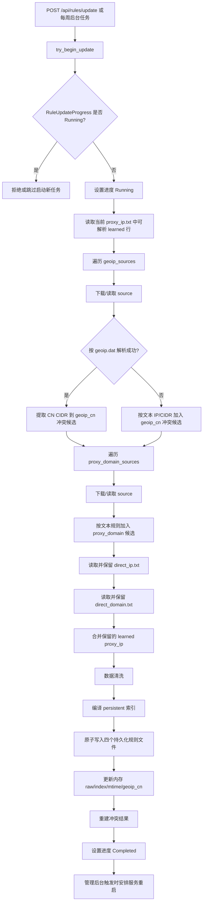


注：
流程图中的“数据清洗”指写入四个持久化规则文件前，对 `direct_ip`、`direct_domain`、`proxy_ip`、`proxy_domain` 四组列表做统一整理：去掉空行；域名转小写、去掉末尾 `.`，并去掉 `domain:` / `full:` / `regexp:` / `keyword:` 前缀；排序并去重。

流程图中的“合并保留的 learned proxy_ip”指 Generate 开始时读取当前 `data/proxy_ip.txt`，保留第一列能解析为 IP/CIDR 的 learned 行，并把这些行合并进本次生成的 `RuleLists.proxy_ip`。随后 `normalize_proxy_ip_lines` 会按第一列 IP/CIDR 去重；同一个 IP 同时存在一列行和带域名行时，优先保留带域名行。这里的“合并”不做 CIDR 覆盖压缩，也不会把被 CIDR 覆盖的单 IP 删除。最终结果会重新写回 `data/proxy_ip.txt`，并重新编译成内存中的 `persistent.proxy_ip` / `persistent.proxy_ip_exact` 索引。
`proxy_ip` 额外按第一列 IP/CIDR 去重，并优先保留带域名行。

例如 Generate 前 `data/proxy_ip.txt` 是：

```text
1.1.1.1
1.1.1.1 cloudflare.com
2.2.2.0/24
2.2.2.8 dns.example
bad-line
example.com
```

合并保留后是：

```text
1.1.1.1 cloudflare.com
2.2.2.0/24
2.2.2.8 dns.example
```

其中 `1.1.1.1` 与 `1.1.1.1 cloudflare.com` 按同一个 IP 去重并保留带域名行；`2.2.2.0/24` 与 `2.2.2.8 dns.example` 都保留，因为当前不做 CIDR 覆盖合并；`bad-line` 和 `example.com` 的第一列不是 IP/CIDR，会被丢弃。

### DNS 运行时来源

- `local_dns_address` / `local_dns_port` -> domestic DNS。
- `remote_dns_address` / `remote_dns_port` -> foreign DNS。
- `local_address` / `local_port` -> 本地 DNS listener。

## 启动生命周期

`RoutingState::load` 是路由状态的启动入口。

完整流程：

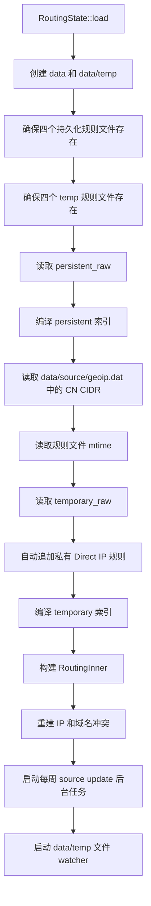


启动后，`LocalServerBuilder` 继续完成本地 listener 装配：

- 如果当前配置不是 `"firewall"` 或 `"both"`，Linux 启动时会尽力删除遗留的 `inet ssrust_dns` 表。
- 当启动 `protocol: "dns"` listener 且 `dns_intercept_mode` 是 `"firewall"` 或 `"both"` 时，会安装 Linux DNS 防火墙拦截。
- 防火墙安装成功后，会把当前 persistent + temporary Proxy IP 规则同步到 nft Proxy set，并过滤掉命中 persistent + temporary Direct IP 的元素。
- 进程重启会重新读取 `data/temp/*.temp`，重建 Temporary Lists 的内存 index；后续域名决策、IP 决策和 nft 同步都继续遵守 temporary 优先级。
- 持久化规则：
  - `data/direct_ip.txt`：由用户手动填入，默认空；Generate 时读取并原样保留。
  - `data/direct_domain.txt`：由用户手动填入，默认空；Generate 时读取并原样保留，当前文件不为空时不会被清理。
  - `data/proxy_ip.txt`：Generate 时保留其中可解析的 learned IP/CIDR 行。
  - `data/proxy_domain.txt`：Generate 时由 `proxy_domain_sources` 的解析结果生成，默认来源是 `data/source/gfw.txt`。
- 临时规则和冲突结果：`data/temp/`。
- 连接记录：`data/record.txt`。
- Temporary Lists 不会写入 `direct_ip.txt`、`direct_domain.txt`、`proxy_ip.txt` 或 `proxy_domain.txt`。
- `proxy_domain.txt` 通常由 `data/source/gfw.txt` 生成；`proxy_ip.txt` 主要保存运行时从 DNS 学到的 Proxy IP。
- DNS 查询域名命中 `proxy_domain.txt` 或 Temporary Lists Proxy Domain 时使用 `remote_dns_address` 解析；未命中时使用 `local_dns_address`。如果同一域名同时命中 `direct_domain.txt` 或 Temporary Lists Direct Domain，则 Direct 优先，使用 `local_dns_address`。

### 临时规则

临时规则位于 `data/temp`：

- `data/temp/direct_ip.temp`
- `data/temp/direct_domain.temp`
- `data/temp/proxy_ip.temp`
- `data/temp/proxy_domain.temp`

这些文件只用于持久化 Temporary Lists 内存状态，不参与生成四个持久化规则文件。临时规则优先级高于持久化规则。读取临时规则时，如果 `data/temp/*.temp` 为空但旧版 `data/*.temp` 有内容，会迁移旧内容。

Temporary Lists 的四类规则分别对应内存中的 temporary Direct/Proxy 域名和 IP 规则；它们可以临时覆盖 source 生成结果或用户持久化规则，但只落盘到 `data/temp/*.temp`。

代码还会自动把以下地址加入临时 Direct IP 规则，用于保护私有、本地、链路本地和组播地址：

- `0.0.0.0/8`
- `127.0.0.0/8`
- `10.0.0.0/8`
- `100.64.0.0/10`
- `169.254.0.0/16`
- `172.16.0.0/12`
- `192.168.0.0/16`
- `198.18.0.0/15`
- `::/128`
- `::1/128`
- `fc00::/7`
- `fe80::/10`
- `ff00::/8`

### 规则读取和规范化

规则文件按行读取：

- `#` 后面的内容被视为注释。
- 空行会被忽略。
- 写入文件时使用临时文件 + rename 的原子写入方式。

IP 规则：

- 每行第一列是 IP 或 CIDR。
- 精确 IP 会转换为单 IP 网段。
- `proxy_ip.txt` 支持第二列域名，例如：

```text
142.250.72.14 www.google.com
```

`proxy_ip.txt` 规范化时按第一列 IP/CIDR 去重。如果同一个 IP 同时存在一列行和带域名行，优先保留带域名行。

域名规则：

- 会去掉首尾空白。
- 会去掉末尾 `.`。
- 会去掉 `domain:`、`full:`、`regexp:`、`keyword:` 前缀。
- 会转换为 ASCII 小写。

## 路由决策引擎

### 技术原理

路由决策是两层优先级：

1. 临时规则优先于持久化规则。
2. 同一层级中 Direct 优先于 Proxy。

返回值为 `Option<RouteDecision>`：

- `Some(Direct)`：明确直连。
- `Some(Proxy)`：明确代理。
- `None`：连接路径没有命中 routing rule 时继续 ACL/reverse cache；DNS 查询层会把域名规则未命中视为 `Direct`，即使用 local DNS。

### 域名匹配

域名决策入口是 `route_domain_inner`。

匹配规则：

- wildcard 只支持 `*.domain.tld` 这一种形式。
- `*.baidu.com` 等同于 `baidu.com`，会同时匹配 `baidu.com` 和 `a.baidu.com`。
- `api.*`、`*foo*`、`*.com` 这类复杂或过宽 wildcard 会在加载/保存规则时报错。
- 单标签规则只精确匹配，例如 `cn` 只匹配 `cn`。
- 多标签规则匹配自身和子域名，例如 `pki.goog` 匹配 `pki.goog` 和 `c.pki.goog`。
- Direct 与 Proxy 同时匹配时 Direct 胜出。
- 域名规则会预编译为 exact 和 suffix 索引。普通域名和 `*.domain.tld` 后缀规则都走 HashSet 候选查找，不遍历全量规则。
- 根据域名规则选择 local resolver 或 remote resolver。
- 把 DNS 结果反向反馈给路由系统，形成运行时 IP 规则和 nft Proxy set。

### DNS 查询完整流程

DNS 路由只处理：

- `DNSClass::IN`
- 非 `PTR` 查询

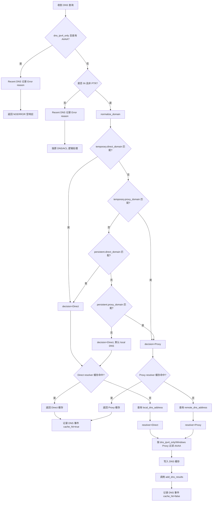


注：`HTTPS` 和 `SVCB` 查询也属于 `DNSClass::IN` 的非 `PTR` 查询，因此会进入上面的域名路由流程：命中 Direct 域名规则时走 `local_dns_address`，命中 Proxy 域名规则时走 `remote_dns_address`，未命中时默认走 `local_dns_address`。查询会被原样转发给对应上游 DNS，上游返回的 `HTTPS` / `SVCB` 响应也会原样返回给客户端。DNS 缓存 key 会保留原始查询类型，所以同一域名的 `A`、`AAAA`、`HTTPS`、`SVCB` 分别缓存。运行时 IP 学习只从 DNS answer 中提取 `A` / `AAAA` 记录；`HTTPS` / `SVCB` 记录本身不会写入 `proxy_ip.txt` 或 nft Proxy set。如果这类响应额外夹带 `A` / `AAAA` answer，才会按当前 resolver 决策调用 `add_dns_results` 学习这些 IP。

注：不满足 `DNSClass::IN` 且非 `PTR` 的查询不会进入 routing DNS 流程，但仍会继续按原 DNS/ACL 逻辑处理。Recent DNS 会记录这类查询，并在 Results 列显示 `Error: DNS routing skipped because ...`，用于说明它没有按 Direct/Proxy 域名规则选择 resolver。

## DNS 服务集成

### 技术原理

DNS 服务承担两件事：

- 对普通 Internet 正向查询执行域名路由，选择 `local_dns_address` 或 `remote_dns_address`。
- 记录 DNS 响应并调用 `add_dns_results`，让 Proxy DNS 结果学习到 `proxy_ip.txt` 和 nft Proxy set。

### IPv4-only 逻辑

`dns_ipv4_only = true` 时：

- AAAA 查询直接返回 NOERROR 空答案。
- Recent DNS 的 Results 会显示 `Error: AAAA query suppressed because dns_ipv4_only is enabled`。
- 非 AAAA 查询返回结果中如果夹带 AAAA，也会过滤掉。

即使关闭全局 IPv4-only，Windows 上的 Proxy DNS 响应仍会过滤 AAAA。原因是当前 Windows TUN catch-all 只安装 IPv4 路由，保留 Proxy AAAA 会导致浏览器先尝试无法连通的 IPv6。

### DNS 缓存

DNS 缓存 key 包含：

- 规范化域名。
- 查询类型。
- resolver：`Direct` 或 `Proxy`。

因此 DNS 缓存区分 `Direct` 和 `Proxy`。同一个域名和查询类型，如果分别通过 local DNS 和 remote DNS 解析，会落到两个不同缓存 key；命中 `Direct` 规则只查 Direct 缓存，命中 `Proxy` 规则只查 Proxy 缓存。

缓存行为：

- 插入时设置 `expires_at = now + dns_cache_ttl_seconds`。
- 查询前调用 `prune_dns_cache` 清理过期项。
- 超过 `dns_cache_capacity` 时按 FIFO 顺序移除旧 key。
- 管理后台支持按域名查询、按 IP 查询、按域名清理和全部清理。

Proxy 缓存刷新：

- DNS server 启动 remote DNS cache refresh 后台任务。
- 每 24 小时检查一次候选。
- 只刷新 resolver 为 `Proxy` 且 `refreshed_at` 超过 24 小时的缓存。
- 每批最多 `dns_cache_refresh_batch_size` 条。
- 刷新成功后替换 DNS message 和结果 IP，更新 `refreshed_at`，但保留原 `expires_at`。
- 刷新得到新 IP 时继续调用 `add_dns_results(RouteDecision::Proxy, ...)`。

## 运行时 IP 学习

### 技术原理

DNS 是域名规则和 IP 规则之间的桥。域名命中 Proxy 后，后续透明代理真正看到的是目标 IP；因此系统需要把 Proxy 域名解析出的 IP 学进
`proxy_ip.txt` 和 Linux nft Proxy set。

Direct DNS 结果不会写入 `direct_ip.txt`，也不会加入 persistent Direct 内存索引；它只会从 Linux Proxy set 中移除对应 IP，避免 Direct 域名的解析结果被旧 Proxy set 重定向。

### add_dns_results 流程

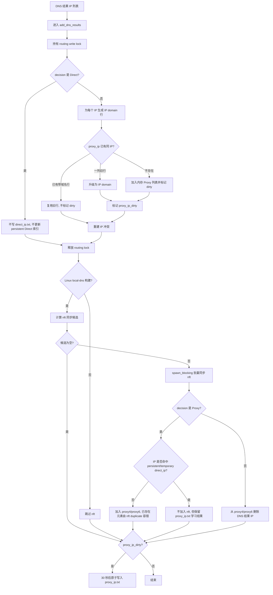


重要实现细节：

- Direct 分支不写入 `direct_ip.txt`，不更新 persistent Direct 索引，只驱动 nft Proxy 删除。
- Proxy 分支先更新内存并标记 dirty，随后延迟 30 秒批量写入 `proxy_ip.txt`。
- Proxy 分支解析出的 IP 即使命中 `direct_ip.txt` 或 Temporary Lists Direct IP，也会写入 `proxy_ip.txt`；但这类 IP 不会加入 nft Proxy set。
- Proxy 分支会把文件去重和 nft 对账拆开：即使 IP 已经存在于 persistent Proxy 内存/`proxy_ip.txt`，只要未被 persistent/temporary Direct IP 覆盖，仍会进入 nft Proxy set 同步候选。这用于修复 `replace_route_nets`、nft table 重建或外部修改造成的 nft set 与内存脱节。
- 命中 Proxy DNS cache 时也会调用 `add_dns_results(RouteDecision::Proxy, ...)`，因此持续访问并一直命中 cache 的域名仍能补回缺失的 nft Proxy 元素。
- `proxy_ip.txt` 持久化使用原子写入，并会排序、去重、优先保留带域名行。
- Linux nft 同步放到 `spawn_blocking`，避免阻塞 Tokio worker。
- `nft -f -` 按 IPv4/IPv6 和每 512 个元素分块批量提交。duplicate nft element 错误按幂等同步处理并被忽略。

### Generate 对 learned IP 的影响

`direct_ip.txt` 会在 Generate 时读取并保留；`data/temp/direct_ip.temp` 只用于恢复 Temporary Lists 的 Direct IP 内存规则。geoip.dat 不写入 `direct_ip.txt`，只用于 IP Conflicts。

`proxy_ip.txt` 中第一列可解析的 learned IP/CIDR 会在 Generate 开始时读取并保留，因此 Proxy 学习结果会跨 Generate 保留。

## Linux DNS 防火墙拦截

### nftables 技术原理

Linux/OpenWrt 防火墙拦截使用 `inet ssrust_dns` 表。当前表中会创建四个 interval set：

- `direct4`
- `direct6`
- `proxy4`
- `proxy6`

当前 TCP 透明重定向规则实际使用的是 `proxy4` / `proxy6`。Direct 优先级主要通过过滤或删除 Proxy set 中与 Direct 重叠的元素实现。`direct4` / `direct6` 作为辅助 set 创建，但当前重定向规则不依赖它们。

### nftables 安装流程

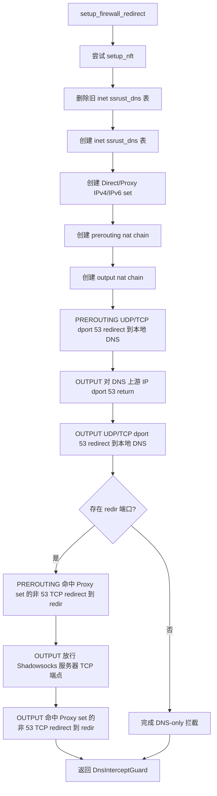


`DnsInterceptGuard` 在 drop 时会删除 `inet ssrust_dns` 表。非正常退出无法触发 drop，所以启动时如果当前配置不启用 firewall 模式，会主动清理遗留表。

### iptables 回退

如果 `setup_nft` 失败，会回退到 `setup_iptables`：

- `PREROUTING` UDP/TCP 53 redirect 到本地 DNS。
- `OUTPUT` UDP/TCP 53 redirect 到本地 DNS。

Linux redir/firewall 模式会拦截 UDP/TCP 53 DNS 请求。TUN 模式会在 TUN UDP/TCP 路径拦截目标端口 53 的 DNS 请求，并转发到同一个本地 DNS listener。

- `OUTPUT` 中先对 DNS 上游 IP 的 UDP/TCP 53 return。
- `OUTPUT` UDP/TCP 53 redirect 到本地 DNS。

iptables 回退不维护 Proxy IP set，因此不能提供 nft Proxy set 驱动的非 53 TCP 重定向能力。

### persistent/temporary 规则同步到 nft

防火墙安装成功后会调用 `sync_persistent_ip_rules_to_firewall`：

- 从 persistent Proxy IP 中移除与 persistent Direct IP 重叠的网段。
- flush `direct4`、`direct6`、`proxy4`、`proxy6`。
- 将过滤后的 Proxy 网段写入 `proxy4` / `proxy6`。

临时规则保存后会重新计算临时 nft Proxy：

- persistent Direct + temporary Direct 共同作为 Direct 优先级来源。
- persistent Proxy + temporary Proxy 作为候选 Proxy。
- 与 Direct 重叠的 Proxy 会被移除。
- 最终替换 nft Proxy set。

## TUN 拦截和 Windows 路由

### TUN DNS 拦截

TUN DNS 拦截入口在 `UdpTun::handle_packet`：

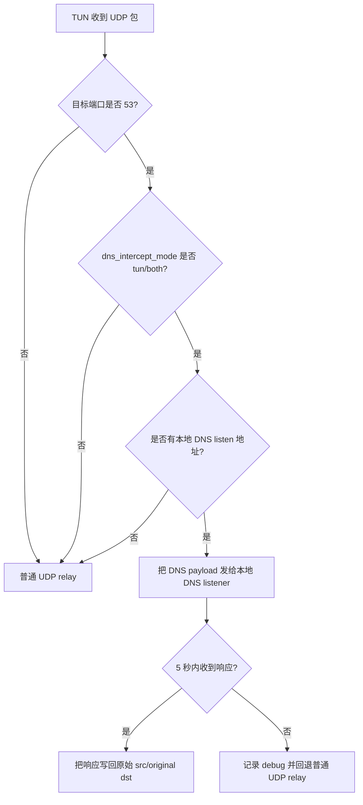


TUN TCP 路径在创建 TCP 透明连接时也检查目标端口 53；命中时直接连接本地 DNS listener 并做 TCP tunnel，不再按普通透明 TCP 连接转发。

如果 listen IP 是 unspecified，会改成 loopback：

- `0.0.0.0` -> `127.0.0.1`
- `::` -> `::1`

### Windows TUN 路由

Windows 使用 TUN 作为透明代理后端。TUN 启动时运行 PowerShell 安装路由：

- 在 TUN adapter 上安装 IPv4 catch-all：`0.0.0.0/1` 和 `128.0.0.0/1`。
- 在物理默认路由网卡上安装常见私有 IPv4 网段，避免内网流量进入 TUN。
- 如果存在 IPv6 默认路由，在物理网卡上安装 `fc00::/7`、`fe80::/10`。
- 为 Shadowsocks 服务器 IP 和 domestic DNS IP 安装 `/32` 物理网卡例外。
- 为物理网关安装 `/32` 例外。

foreign DNS 不加入物理网卡例外。remote DNS 查询通过 Shadowsocks 服务器封装发送，sslocal 不会直接连接 foreign DNS IP。具体实现上，remote resolver 走 DNS 模块的 `lookup_remote` 路径：DNS message 会交给 shadowsocks 客户端流发送到远端 DNS 地址；它不是一律把 UDP DNS 打包成 TCP，实际传输取决于 DNS listener 的 mode，`tcp_only` 使用 TCP，`udp_only` 使用 UDP，`tcp_and_udp` 会按配置/可用性选择或并发查询，插件不支持 UDP 时回退 TCP。

由于当前 Windows catch-all 只覆盖 IPv4，DNS Proxy 响应会过滤 AAAA，避免客户端优先尝试不可达 IPv6。

## 冲突检测

### 技术原理

冲突检测用于发现 Direct 和 Proxy 规则之间的重叠，但不改变路由优先级。真正路由时 Direct 仍然胜出。

冲突来源：

- `direct_ip.txt` vs `proxy_ip.txt`
- `data/source/geoip.dat` 中的 CN CIDR vs `proxy_ip.txt`
- `direct_domain.txt` vs `proxy_domain.txt`

临时规则不参与冲突持久化结果。

### 完整流程

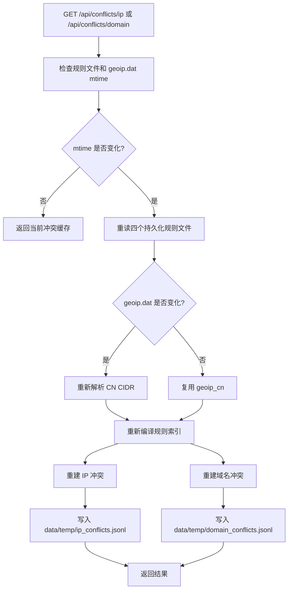


IP 冲突：

- 精确 IP 和 CIDR 都会转换为范围。
- IPv4 与 IPv6 分开比较。
- 输出格式为 `direct <-> proxy`，完全相同时只输出一个值。
- `proxy_ip.txt` 只读取第一列。

域名冲突：

- 精确规则会检查自身和多标签后缀候选。
- `*` 通配符会通过候选域名判断是否可能重叠。
- 单标签规则不会作为顶级域名通配符。

## 管理后台模块

### API 分组

主要 API：

- `GET /api/config/rules`：返回规则目录、source 配置和临时规则快照。
- `GET /api/temp-rules`：从 `data/temp` 重新读取临时规则并刷新内存临时索引。
- `PUT /api/temp-rules`：写入临时规则并刷新 nft Proxy set。
- `POST /api/rules/download`：下载 source。
- `POST /api/rules/update`：下载并生成规则。
- `GET /api/rules/update-progress`：读取下载/生成进度。
- `GET /api/dns` / `PUT /api/dns`：读取或热更新 runtime domestic/foreign DNS。
- `GET /api/dns/cache/stats`：DNS 缓存统计。
- `GET /api/dns/cache/query`：按域名查 DNS 缓存。
- `GET /api/dns/cache/query-ip`：按 IP 查 DNS 缓存。
- `POST /api/dns/cache/clear`：清理 DNS 缓存。
- `GET /api/conflicts/ip` / `GET /api/conflicts/domain`：冲突检测。
- `POST /api/sys/debug-url`：调试 URL。
- `POST /api/sys/debug-ip`：调试 IP/CIDR。
- `GET /api/activity/connections`：最近连接。
- `GET /api/activity/dns`：最近 DNS。
- `POST /api/activity/record/start` / `stop`：开始或停止连接记录。

管理后台只允许 LAN 或 loopback 访问；如果配置了 token，会校验 `x-admin-token`、Bearer token 或 query token。

### Debug URL

`debug_url` 用于验证“域名规则 -> DNS -> 透明代理连接”链路。

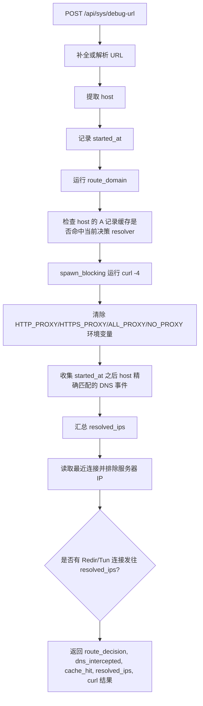


注意：

- `curl` 固定使用 `-4`，超时 6 秒。
- `dns_cache_hit` 只检查 host 的 A 记录，并且 resolver 必须等于当前 `route_domain` 决策。
- 如果没有域名规则，真实 DNS 查询可能会命中 fallback cache，但 Debug URL 的 `dns_cache_hit` 仍可能是 false。

### Debug IP / CIDR

`debug_ip_membership` 用于验证一个 IP/CIDR 是否在持久化 `proxy_ip.txt` 或 Linux nft Proxy set 中。


Debug IP 不检查临时规则，也不检查 Direct 规则。

## 连接和 DNS 活动记录

### 目标语义

- `Recent Connections` 不再展示 `proxy` / `observed`。
- 可展示的 `ConnectionDecision` 收敛为：
  - `direct`
  - `socks5_proxy`
  - `http_proxy`
  - `redir`
  - `tun`
- `Direct` 表示系统快照中未命中 socks/http/redir/tun 标注的普通连接。
- `Proxy` 只保留为路由/DNS 决策语义，不作为连接展示类型。

### 固定 Direct 例外网段

- 以下地址始终按 Direct 处理，适用于 socks/http、redir、tun 入口：
  - `0.0.0.0/8`
  - `10.0.0.0/8`
  - `100.64.0.0/10`
  - `127.0.0.0/8`
  - `169.254.0.0/16`
  - `172.16.0.0/12`
  - `192.168.0.0/16`
  - `198.18.0.0/15`
  - `::/128`
  - `::1/128`
  - `fc00::/7`
  - `fe80::/10`
  - `ff00::/8`
- 固定 Direct 例外网段是独立保护规则，不依赖旧 ACL bypass 逻辑。

### SOCKS/HTTP 出站行为

- socks/http 入口收到请求后，默认通过 SS server 建立连接。
- socks/http 入口目标命中私有、本地、链路本地、组播或保留网段时，仍然走 Direct。
- 不再让 socks/http 入口根据 routing/ACL 走 Direct；上述固定 Direct 例外是独立保护规则。
- 旧 ACL bypass 逻辑不删除、不重构，只是不用于 socks/http 入口的出站选择。
- Recent Connections:
  - SOCKS5 入口记录 `socks5_proxy`
  - HTTP 入口记录 `http_proxy`
  - socks/http 命中固定 Direct 例外网段时记录 `direct`

### redir/tun 行为

- redir/tun 入口保持现有透明代理逻辑。
- Linux nftables 透明代理规则同时支持 `redirect` 和 `tproxy` 两种机制：
  - `redirect` 属于 NAT/REDIRECT 路径，当前 Linux firewall 自动安装的 TCP Proxy IP 规则使用 `redirect to :redir_port`。
  - `tproxy` 属于透明代理路径，通常配合 mark、policy routing 和 `IP_TRANSPARENT`，可用于 TCP/UDP；Linux redir UDP 默认使用 `tproxy`。
- 无论底层使用 `redirect` 还是 `tproxy`，redir 应用层事件必须记录用户原始目标，例如 `119.119.119.119:443`，不能记录本地 redir 监听地址或监听端口。
- redir/tun 目标命中固定 Direct 例外网段时，也必须走 Direct。
- Linux redir/firewall 模式下，固定 Direct 例外网段不应加入 nft Proxy set；如果已存在，应从 nft Proxy set 中过滤或删除。
- TUN 模式下，固定 Direct 例外网段应走 Direct 路由，不应被 TUN/Proxy 路径再次捕获。
- redir/tun 连接记录按实际出站结果显示：
  - 实际走透明代理路径时，redir -> `redir`，tun -> `tun`。
  - 实际走 Direct 时记录 `direct`，包括固定 Direct 例外网段，以及 route_rules 判定为 Direct 的目标。
- 不把 redir/tun 内部路由判断结果显示成 `proxy`。

### SS Server 出口保护

- SS server IP 地址必须始终能从 WAN/物理出口出去；这是全局约束，适用于 socks/http、redir、tun 以及它们同时启用的场景。
- socks/http 代理模式下，`sslocal -> ss-server` 的连接也必须直接从 WAN/物理出口出去，不能被 redir/firewall OUTPUT 规则或 TUN catch-all 再次捕获。
- Linux redir/firewall 模式下：
  - nft/iptables OUTPUT 规则必须对 SS server IP 执行 return，避免 `sslocal -> ss-server` 被重定向回 redir。
  - SS server IP 不应加入 nft Proxy set；如果规则重建或 DNS 学习误加入，必须过滤或删除。
- TUN 模式下：
  - SS server IP 必须安装物理网卡/WAN 路由例外，避免 `sslocal -> ss-server` 进入 TUN。
  - Windows TUN/OpenWrt/Linux TUN 部署脚本都需要保证该例外存在。
- Recent Connections 仍过滤目标为 SS server IP 的连接，因为它是代理隧道出口，不是用户访问目标。

### 系统连接快照

- `recent_connections()` 以 conntrack + `/proc/net/tcp`、`udp`、`tcp6`、`udp6` 为主数据源。
- 读取所有出站连接后过滤：
  - 目标地址为 SS server IP 的连接
  - 固定 Direct 例外网段 / unspecified / listen 行
- 每条系统连接默认标为 `direct`。
- 用 `flow_decisions` 按 5 元组 O(1) 查表：
  - 命中 `socks5_proxy` / `http_proxy` / `redir` / `tun` 时覆盖显示
  - 未命中保持 `direct`

### 补充应用层记录

- 因为 socks/http 的真实出站连接是 `sslocal -> ss-server`，会被 SS server filter 过滤掉，所以还需要从 `record_connection` 补充应用层连接。
- 只补充以下入口类型：
  - `socks5_proxy`
  - `http_proxy`
  - `redir`
  - `tun`
- 不补充 `proxy` / `observed`。
- 和系统快照用 `connection_key` 去重。

### Record 开关和生命周期

- Record 默认不开启；进程启动后不采集 `Recent DNS` / `Recent Connections`，也不维护本轮活动记录。
- 只有管理页面勾选 `Record` 时，才开启 `Recent DNS` 和 `Recent Connections` 功能。
- `Record` 开启时：
  - 记录当前 conntrack 和 `/proc/net/*` 中已经存在的系统连接 baseline。
  - 清空本轮内存活动状态，包括 `connections`、`dns`、`flow_decisions`、`reverse_domains`、页面去重用的 hash set 等。
  - 清空 `data/record.txt`，作为新一轮记录文件。
  - 开始采集 Recent DNS 和 Recent Connections。
  - Recent Connections 中出现的新连接需要继续追加写入 `data/record.txt`。
- `Record` 关闭时：
  - 停止采集 Recent DNS 和 Recent Connections。
  - 清空本轮内存活动状态和页面去重 hash set。
  - 不要求清空 `data/record.txt`。
- `Record` 每次最多开启 5 分钟。
- 5 分钟到期后，后端自动停止 Record：
  - 页面需要实时感知到状态变化，并自动取消勾选 `Record`。
  - 自动停止时清空本轮内存活动状态和页面去重 hash set。
  - 自动停止时不要清空 `data/record.txt`，保留本轮已经写入的记录。
- 手动再次勾选 `Record` 时，重新清空 `data/record.txt` 并开始新一轮 5 分钟记录。

### 性能设计

#### 关键数据结构

- `excluded_remotes`
  - 含义：当前配置中的 Shadowsocks server IP 过滤集合，由 local server 配置在进程启动或配置加载时生成。
  - 用途：过滤 `sslocal -> ss-server` 这类代理隧道出口连接。它不是用户访问的真实目标，如果展示出来会污染 Recent Connections。
  - 数据结构：进程启动或 local server 配置加载时，把 server IP 列表预处理成 `HashSet<IpAddr>`，保存为可复用的过滤集合。`recent_connections()` 每次只接收或读取这个已经构建好的集合，不在轮询请求里重复从 `Vec` 转 `HashSet`。
  - 更新时机：只有配置热更新、server 地址变更或管理后台重新加载配置时才重建一次。普通 Connections tab 轮询不重建。
- `flow_decisions`
  - 含义：应用层记录的权威连接决策表，用来把内核快照中看到的连接重新标记为 socks/http/redir/tun/direct。
  - key：`FlowKey = (source_ip, source_port, destination_ip, destination_port, protocol)`，即 TCP/UDP 5 元组。
  - value：`ConnectionDecision`，也就是应用层入口已经确认过的决策。
  - 作用：conntrack 和 `/proc/net/*` 只能看到系统连接，无法知道这条连接最初来自 SOCKS5、HTTP、redir 还是 TUN；`flow_decisions` 用同一个 5 元组把系统连接映射回应用层决策。
  - 只记录有 IP 的连接。域名目标如果还没有解析成 IP，无法和内核 5 元组匹配，所以不进入 `flow_decisions`。
  - 生命周期：只在本轮 Record 的 5 分钟窗口内存在。Record 开启时清空，Record 关闭或到期时整体清空，因此查询路径不再做逐项过期检查或复杂淘汰。
- `system_connection_baseline`
  - 含义：Record 开启瞬间已经存在的 conntrack / `/proc/net/*` 连接 5 元组集合。
  - 用途：避免 Record 开启前就已经建立的长连接被轮询时重新打上当前时间，并作为新的默认 `direct` 系统快照行进入 Recent Connections。
  - key：同 `flow_decisions` 的 `FlowKey`，不包含展示用域名；后续 DNS 反查补上域名后仍能命中 baseline。
  - 生命周期：只在本轮 Record 窗口内存在。Record 开启时重建，Record 关闭或到期时清空。
- `system_connection_first_seen`
  - 含义：非 baseline 系统连接在本轮 Record 中第一次被观察到的时间。
  - 用途：conntrack 和 `/proc/net/*` 不提供连接创建时间；页面每秒轮询时不能把同一条系统快照连接反复更新时间为当前时间，否则默认 `direct` 的系统行会一直浮在真实应用层 `redir` 记录上方。
  - 生命周期：只在本轮 Record 窗口内存在。Record 开启时清空，Record 关闭或到期时清空。
- `connections`
  - 含义：Recent Connections 的应用层事件队列，保存 `record_connection()` 主动记录的连接事件。
  - 数据结构：`VecDeque<ConnectionEvent>`，只保存本轮 Record 内的事件。
  - 用途：补充系统快照看不到或被 SS server filter 过滤掉的应用层连接，例如 socks/http 的真实用户目标。
- `reverse_domains`
  - 含义：`IpAddr -> domain` 的反向域名缓存，由 DNS 记录填充。
  - 用途：系统快照只有 IP，展示时可用它补回域名，提升 Recent Connections 可读性。
  - 读取方式：`recent_connections()` 开始阶段读取本轮快照，后续读取 conntrack/proc 时只使用快照数据。
- `dedupped_recent_connections`
  - 含义：`recent_connections()` 本次生成返回列表时使用的临时去重集合，不是长期状态，也不跨请求保存。
  - key：`connection_key(event)`，用于描述“一条连接是谁到谁、用什么协议访问哪个端口”。建议包含：
    - `source_ip`
    - `source_port`
    - `destination_ip`
    - `destination_domain`
    - `destination_port`
    - `protocol`
  - 为什么需要：同一条连接可能同时出现在两个来源：
    - 应用层 `connections`：由 socks/http/redir/tun 入口主动记录，decision 更准确。
    - 系统快照：由 conntrack 或 `/proc/net/*` 观察到，覆盖面更完整。
  - 使用方式：
    - 第一步只处理应用层 `connections`：应用层事件先追加到返回结果，并把它们的 `connection_key` 写入 `dedupped_recent_connections`。这一步不因为系统快照而丢弃应用层事件。
    - 第二步才处理系统快照：每条系统快照连接计算同样的 `connection_key`，只有 `dedupped_recent_connections.insert(connection_key)` 成功时才追加到返回结果；如果 insert 失败，说明应用层事件已经占用了这个 key，丢弃的是当前这条系统快照记录。
    - 因此优先级由处理顺序保证：应用层记录先进入结果，系统快照只能补充缺失连接，不能覆盖或过滤已经进入结果的应用层记录。
  - 示例：客户端请求 `119.119.119.119`，规则判定走 redir。redir 入口会主动记录一条 `destination_ip = 119.119.119.119`、`decision = redir` 的应用层连接；conntrack/proc 之后也可能观察到同一个 5 元组。合并时应用层记录已经先进入结果并写入 `dedupped_recent_connections`，系统快照处理在后，遇到同一个 key 时 insert 失败，所以被丢弃的是系统快照记录。页面最终只看到一条 `119.119.119.119` 连接，decision 显示 `redir`。
  - redir 注意事项：不管 nftables 使用 `redirect` 还是 `tproxy`，应用层 `connections` 里的 redir 事件都必须使用用户原始目标构造 `connection_key`。如果错误地使用本地 redir 监听地址，应用层事件和系统快照就不会命中同一个 key，页面会出现重复或错误目标。

#### 完整工作流程

1. Record 开启
  - 管理页调用 `POST /api/activity/record/start`。
  - 后端设置 Record 状态为开启，并记录本轮 `record_session_id` 和 5 分钟过期时间。
  - 后端向 Record worker 投递 `StartSession(record_session_id)` 命令。
  - Record worker 串行执行本轮初始化：
    - 清空本轮内存活动状态：`connections`、`dns`、`flow_decisions`、`reverse_domains`、页面去重集合等。
    - 清空 `data/record.txt`，作为新一轮记录文件。
    - 重置 dropped counter。
  - `record_connection()` / `record_dns()` 只有在 Record 状态开启且未过期时，才允许向 Record 队列投递事件。
2. 连接建立时异步投递
  - socks/http/redir/tun 等入口在连接建立或转发时调用 `record_connection(source, target, protocol, decision)`。
  - `record_connection()` 位于转发热路径，只允许做固定小成本操作：
    - 读取 Record 开关、过期时间和当前 `record_session_id`。
    - 如果 Record 未开启或已过期，立即返回。
    - 构造轻量 `RecordEvent::Connection { session_id, source, target, protocol, decision }`。
    - 使用非阻塞 `try_send` 投递到 Record 队列。
  - `record_connection()` 不直接写入 `connections`，不直接更新 `flow_decisions`，不直接追加 `record.txt`，也不等待 Record worker 完成。
  - 如果 Record 队列已满，丢弃当前 Record 事件并增加 dropped counter；不能阻塞或反压代理转发。
3. Record worker 消费连接事件
  - Record worker 从队列中串行消费 `RecordEvent::Connection`。
  - 如果事件的 `session_id` 不是当前本轮 Record，说明它来自旧会话或过期投递，直接丢弃。
  - 如果目标包含 `destination_ip` 且协议是 TCP/UDP，就生成 5 元组写入 `flow_decisions`：
    - socks5 入口写 `socks5_proxy`
    - http 入口写 `http_proxy`
    - redir 入口写 `redir`
    - tun 入口写 `tun`
    - 实际 Direct 出站写 `direct`
  - 把 `ConnectionEvent` 追加到 `connections`，作为应用层 Recent 事件。
  - 如果该连接是本轮 Record 中首次出现的新连接，追加写入 `data/record.txt`。
4. DNS 记录异步投递和消费
  - DNS 热路径调用 `record_dns()` / `record_dns_error()`。
  - 函数只检查 Record 状态并通过 `try_send` 投递 `RecordEvent::Dns` / `RecordEvent::DnsError`，不直接更新 Recent DNS，也不写文件。
  - Record worker 消费 DNS 事件后：
    - 写入 Recent DNS。
    - 用 DNS 结果维护 `reverse_domains`，建立 `IP -> domain` 映射。
    - 丢弃旧 `session_id` 或过期事件。
  - 后续系统快照只看到 IP 时，可以通过 `reverse_domains` 补上域名。
5. 管理页请求 Recent Connections
  - 页面轮询 Record 状态。
  - 如果 Record 关闭或 5 分钟到期，页面清空 Recent DNS / Recent Connections 表格，不再请求列表数据；后端也应清理本轮内存活动状态。
  - 如果 Record 开启，页面调用 `GET /api/activity/connections`，后端执行 `recent_connections()`，并使用已经预构建好的 SS server IP 过滤集合。
  - `recent_connections()` 读取的是 Record worker 已经维护好的本轮快照；页面请求不参与热路径记录。
6. `recent_connections()` 合并数据
  - 使用进程启动或配置加载时已经构建好的 `excluded_remotes: HashSet<IpAddr>`，用于过滤 SS server IP。
  - 读取本轮 Record 的内存快照：
    - `connections`
    - `flow_decisions`
    - `system_connection_baseline`
    - `system_connection_first_seen`
    - `reverse_domains`
  - 这里不需要 routing write lock，也不需要在查询路径做逐项清理：
    - Record 只有 5 分钟窗口，数据生命周期由 Record start/stop/expire 统一控制。
    - Record 开启时整体清空旧状态，关闭或过期时整体清空本轮状态。
    - `recent_connections()` 只负责读快照和合并展示，不负责维护生命周期。
  - 从 `connections` 倒序取出应用层事件，并过滤 SS server IP。
  - 用这些应用层事件初始化 `dedupped_recent_connections` 去重集合。
  - 读取系统连接快照：
    - conntrack
    - `/proc/net/tcp`
    - `/proc/net/udp`
    - `/proc/net/tcp6`
    - `/proc/net/udp6`
  - 每条系统连接先过滤 listen、unspecified、固定 Direct 例外网段、SS server IP。
  - 如果系统连接命中 `system_connection_baseline`，说明它在 Record 开启前已经存在，不作为本轮 Recent 新连接展示。
  - 如果系统连接未命中 baseline，使用 `system_connection_first_seen` 中的稳定时间；第一次观察到时才写入当前时间，后续轮询不刷新。
  - 系统连接默认标记为 `direct`。
  - 如果系统连接 5 元组命中 `flow_decisions`，用权威决策覆盖默认值。
  - 如果 `dedupped_recent_connections` 中没有同一条连接，则追加到返回结果。
  - 最后按 timestamp 倒序排序后返回。
7. Record 关闭或过期
  - 手动关闭时，管理页调用 `POST /api/activity/record/stop`。
  - 5 分钟到期时，后端自动把 Record 状态切到关闭。
  - 后端向 Record worker 投递 `StopSession(record_session_id)` 命令。
  - Record worker 清空本轮内存活动状态和页面去重集合，停止接受旧 `session_id` 事件。
  - 不清空 `data/record.txt`，保留本轮已经写入的记录。
  - 关闭后热路径再次调用 `record_connection()` / `record_dns()` 会因为 Record 状态关闭而立即返回。

#### 为什么性能好

- Record 异步化，避免阻塞实时转发：
  - 转发热路径只做最小工作：
    - 读取 Record 开关和过期状态。
    - Record 未开启时立即返回。
    - Record 开启时构造轻量 `ConnectionEvent` / `DnsEvent`。
    - 使用非阻塞 `try_send` 投递到后台 Record 队列。
  - 热路径禁止做以下操作：
    - 等待 async lock。
    - 写 `record.txt`。
    - 读取 conntrack 或 `/proc/net/*`。
    - 做页面级去重。
    - 做逐项清理、排序或复杂聚合。
  - 后台 Record worker 负责消费队列并维护本轮状态：
    - `connections`
    - `dns`
    - `flow_decisions`
    - `reverse_domains`
    - `record.txt` 追加写入
  - 队列必须有容量上限。高并发时如果队列满，优先丢弃 Record 事件并增加 dropped counter，不能反压代理转发。
  - 因此 Record 对实时路由转发的影响被限制为固定成本：一次开关判断、一次事件构造和一次非阻塞入队；不会因为磁盘 IO、页面轮询或系统快照采集拖慢连接处理。
  - 严格说不能做到“完全没有影响”，因为开启 Record 时总要采集元数据；但可以做到不阻塞、不等待、不反压，性能影响可控且可观测。
- SS server 过滤从线性扫描变成哈希查找：
  - `excluded_remotes` 通常很小，但系统快照连接数可能很大。
  - 每条连接都要判断是否是 SS server 出口，把列表在启动或配置加载时预处理成 `HashSet<IpAddr>` 后，过滤成本稳定为 O(1)。
  - 这个 HashSet 不在每次 Connections tab 轮询时重建，避免把固定配置成本放到查询热路径。
- 决策重标记是 5 元组 O(1) 查表：
  - 不按 IP、端口或域名单独模糊搜索，避免误判和额外扫描。
  - `flow_decisions` 的 key 与 conntrack/proc 能提供的连接身份一致，系统快照行可以直接构造同一个 key 查询。
- 应用层事件和系统快照只做一次合并：
  - 先把 `connections` 放入结果并建立 `dedupped_recent_connections`。
  - 再扫描系统快照，只有未见过的连接才追加。
  - 去重是 HashSet O(1)，不会出现双层循环比较。
- 查询路径不做生命周期维护：
  - `recent_connections()` 不拿 routing write lock 做逐项清理。
  - 定期清理和容量淘汰都不是必要设计，因为 Record 每次最多 5 分钟。
  - 生命周期集中在 Record start/stop/expire：开启时清空，关闭或过期时整体释放。
  - conntrack 和 `/proc/net/*` 读取可能涉及文件 IO 和解析，查询路径只做快照合并，避免阻塞 DNS、连接记录和规则更新。
- 内存增长有边界：
  - Record 默认关闭，未开启时不采集活动数据。
  - Record 每次最多 5 分钟，关闭或过期时清空本轮活动状态，避免后台长期积累。
  - 如需防御极端高 churn 环境，可保留简单最大数量上限，但不需要把逐项清理放到查询路径。
- 热路径尽早返回：
  - `record_connection()` / `record_dns()` 在 Record 未开启或过期时立即返回，正常代理流量不承担 Recent 活动记录成本。
  - 固定 Direct 例外目标由入口记录为 `direct`；系统快照仍过滤这些网段，避免把本地/LAN 噪声补入列表。
- 系统快照采集保守串行：
  - 先串行读取 conntrack/proc，逻辑简单且避免额外任务调度。
  - 如果实测路由器或高连接数环境下慢，再把系统快照采集放到 `spawn_blocking` 或拆成并行读取；这属于后续性能验证后的优化，不影响当前方案正确性。

### 代码改动点

- `crates/shadowsocks-service/src/local/routing.rs`
  - 调整 `ConnectionDecision`，去掉或停止使用 `Proxy` / `Observed` 展示值。
  - 修改 `recent_connections()` 合并逻辑。
  - 修改 `collect_system_connections()` 默认 decision 为 `Direct`。
  - 增加 Record 状态、5 分钟过期时间和活动状态清理接口。
  - `record_connection`、`record_dns`、`record_dns_error` 在 Record 未开启或已过期时不写入 Recent 数据。
- `crates/shadowsocks-service/src/local/http/utils.rs` / `http_service.rs`
  - HTTP 入口默认走 SS server。
  - HTTP 目标命中固定 Direct 例外网段时走 Direct，并记录 `ConnectionDecision::Direct`。
  - 记录 `ConnectionDecision::HttpProxy`。
- `crates/shadowsocks-service/src/local/socks/server/socks4/tcprelay.rs`
- `crates/shadowsocks-service/src/local/socks/server/socks5/tcprelay.rs`
  - SOCKS 入口默认走 SS server。
  - SOCKS 目标命中固定 Direct 例外网段时走 Direct，并记录 `ConnectionDecision::Direct`。
  - 记录 `ConnectionDecision::Socks5Proxy`。
- `crates/shadowsocks-service/src/local/net/udp/association.rs`
  - UDP 代理分支按实际出站结果记录 `direct` / `socks5_proxy` / `redir` / `tun`。
  - tunnel UDP 不补充 Recent Connections；否则系统快照默认 direct。
  - UDP 目标实际 Direct 出站时记录 `ConnectionDecision::Direct`。
- redir/tun 相关入口
  - 目标实际 Direct 出站时记录 `ConnectionDecision::Direct`，否则按入口记录 `ConnectionDecision::Redir` / `ConnectionDecision::Tun`。
  - Linux nft/TUN 同步逻辑需要确保固定 Direct 例外网段不会进入 Proxy 捕获路径。
- `crates/shadowsocks-service/src/local/web_admin/mod.rs`
  - `POST /api/activity/record/start`：清空 `record.txt`，清空本轮内存活动状态，开启 5 分钟 Record。
  - `POST /api/activity/record/stop`：停止 Record，清空本轮内存活动状态，不清空 `record.txt`。
  - `GET /api/activity/record/status`：返回 `recording`、`expires_at`、`remaining_seconds`，并在过期时触发自动停止和内存清理。
  - Connections tab 每秒轮询 status；过期后自动取消勾选 `Record` 并清空页面表格。
- `routing.md`
  - 更新 Recent Connections 和连接路径说明。

### 验证

- `cargo check --features 'full local-web-admin local-http-rustls' --bin sslocal`
- `cargo check --no-default-features --features 'local local-http-rustls' --bin sslocal`
- `cargo test -p shadowsocks-service --features local-web-admin,local-dns,local-redir,local-tun local::routing`
- 扫描确保管理页 Recent Connections 不会再输出 `proxy` / `observed`。

## 端到端流程

### 首次访问 Proxy 域名

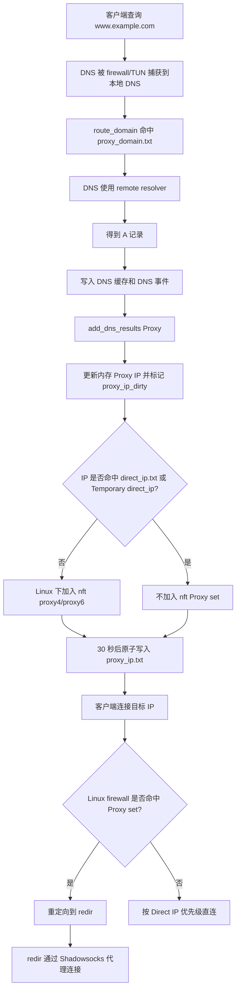


### 首次访问 Direct 域名

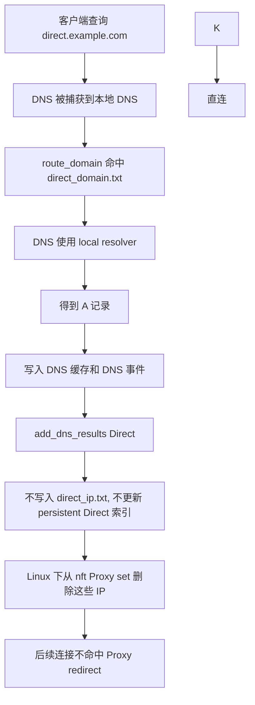


### 无显式域名规则的 DNS 查询

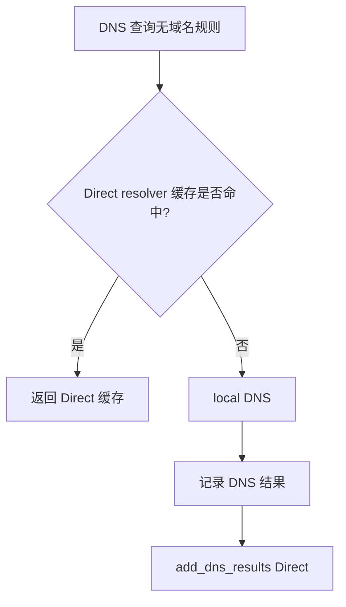


### 管理后台 Generate

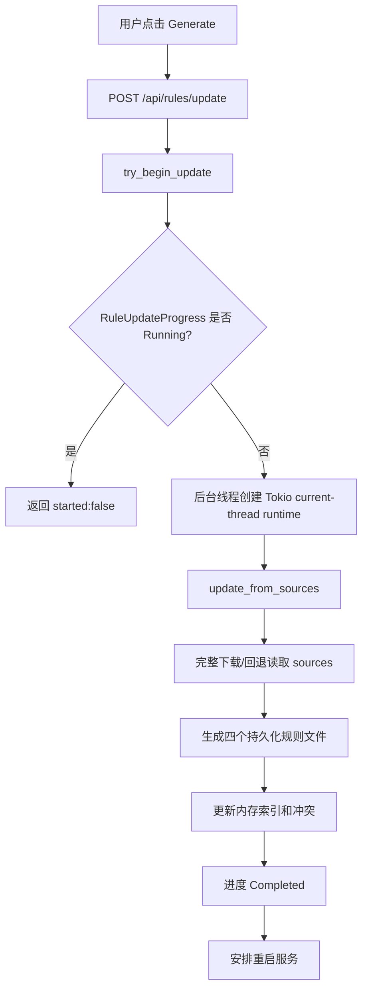


### 临时 Proxy IP 生效

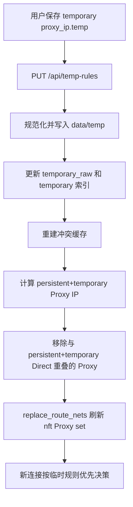

这里使用 `replace_route_nets` 全量刷新 Linux nft Proxy set 是设计行为。保存或重载 Temporary Rules 时，系统会用当前 persistent Proxy IP 加 temporary Proxy IP，再扣除 persistent/temporary Direct IP，重建 `proxy4` / `proxy6`。Direct 优先级因此能立即反映到透明代理路径。

如果全量刷新时的内存 IP 与实际 nft set 已经脱节，后续 Proxy DNS 结果会重新对账 nft；即使命中 DNS cache，Proxy cache hit 也会再次调用 `add_dns_results` 补回缺失元素。


## 运维注意事项

- Linux firewall 模式需要 root 权限或等效 capability。
- `nftables` 是完整功能路径；`iptables` 只提供 DNS 53 端口重定向回退。
- 如果本地 DNS 上游 IP 没有被放行，DNS 请求会回环到本地 DNS listener。
- `dns_ipv4_only` 默认启用，会改变 AAAA 查询结果；只有主机有可用公网 IPv6 时才建议关闭。
- Temporary Lists 只持久化在 `data/temp/*.temp`，不会写入 `direct_ip.txt`、`direct_domain.txt`、`proxy_ip.txt` 或 `proxy_domain.txt`。
- Direct DNS 学习结果不写入 `direct_ip.txt`。
- `proxy_ip.txt` 中可解析 learned 行会被 Generate 保留。
- 临时规则优先生效，但不写入冲突 JSONL。
- Debug IP 只验证持久化 `proxy_ip.txt` 和 nft Proxy set，不代表完整路由决策。
- Debug URL 使用 `curl -4`，因此主要验证 IPv4 透明代理链路。
